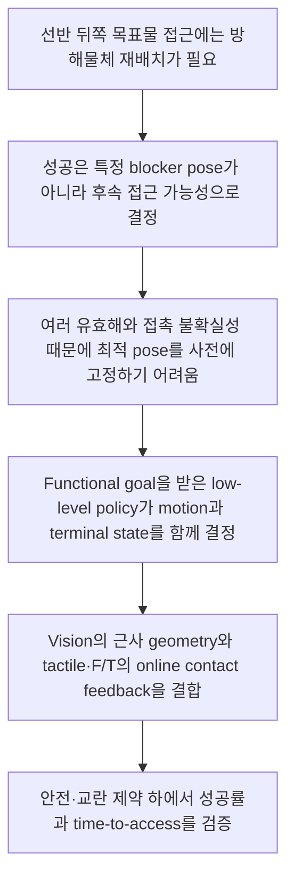

# Functional Target Access를 위한 방해물체 재배치 연구: 논리 구조와 미해결 쟁점

> 작성 기준: 2026-09-29까지의 논의  
> 문서 목적: 현재 연구 논리를 고정하는 문서가 아니라, **확정된 범위·작업 가설·미결정 사항·논리적 허점**을 분리하여 이후 problem definition, Intro, Method, 실험 설계가 서로 어긋나지 않도록 기록한다.

## 0. 상태 표기

- **[현재 합의]** 지금까지의 논의에서 연구 범위로 유지하기로 한 내용
- **[작업 가설]** 이론적으로는 타당하지만 실험으로 입증해야 하는 주장
- **[미결정]** 구현 또는 논문 주장 전에 선택해야 하는 사항
- **[주의]** 현재 근거로는 과도하거나 반례가 존재하는 주장

---

## 1. 현재 연구를 한 문장으로 정의하면

**[현재 합의]**

> High-level task planner가 선택한 방해물체와 후속 grasp/retrieval에 필요한 access condition을 전달하면, low-level goal-conditioned RL policy가 불확실한 near-object handoff 상태에서 vision, tactile, wrist F/T feedback을 이용해 연속적인 arm–hand motion과 종료 상태를 함께 결정하여 목표 물체의 접근 가능성을 확보하는 연구이다.

### 현재 상태 요약

| 구분 | 내용 |
|---|---|
| 현재 합의 | 외부 high-level planner를 가정하고, low-level은 continuous action을 생성한다. Goal은 episode 중 고정하며 시작 pose는 feasible near-object distribution에서 변한다. Hard phase sequence는 강제하지 않는다. |
| 핵심 가설 | Functional access goal이 explicit pose의 over-constraint를 줄인다. Tactile/F/T가 contact uncertainty에서 online correction을 가능하게 한다. 두 요소가 matched-safety 조건에서 success와 time-to-access를 개선한다. |
| 가장 큰 미결정 | Access를 clearance, collision-free path, graspability, downstream skill success 중 무엇으로 정의할 것인가? 한 skill call이 하나의 blocker subgoal인지 전체 access 달성인지? |
| 가장 큰 novelty 위험 | GOMP, RetrDex, access-aware planning, tactile/force-aware IL·VLA가 각 요소를 이미 다룬다. 요소의 결합이 아니라 goal-to-execution interface와 측정된 효과를 보여야 한다. |
| 가장 큰 실험 위험 | Policy가 단순 고정 자세 push로 수렴하거나, contact sensing이 strong force-limited controller보다 이점을 보이지 않거나, proxy access만 증가하고 실제 retrieval은 실패할 수 있다. |

이 문장에서 각 모듈의 역할은 다음과 같다.

- **High-level planner:** 어떤 목표 물체에 접근해야 하는지, 어떤 방해물체를 현재 조작할지, 후속 skill에 어떤 공간 또는 접근 조건이 필요한지를 지정한다.
- **Low-level policy:** 어떤 방향으로 밀고, 회전하고, 재접촉하며, 손가락을 어떻게 구성하고, 언제 동작을 종료할지를 연속 action 수준에서 결정한다.
- **Vision:** 목표 물체, 방해물체, 주변 공간에 대한 전역적이지만 근사적인 geometry를 제공한다.
- **Tactile:** 손 표면의 국소 접촉 위치·분포·변화를 제공한다.
- **Wrist F/T:** 손 전체에 작용하는 resultant force/moment, 충격 및 jam과 관련된 전역 interaction load를 제공한다.
- **Functional goal:** 방해물체의 특정 최종 pose가 아니라 후속 grasp/retrieval motion이 가능해지는 조건이다.

### 연구 범위에서 제외하거나 제한하는 것

- High-level task planner 자체를 학습하는 연구가 아니다.
- 한 episode 도중 high-level goal이 계속 변경되는 상황을 핵심 학습 조건으로 두지 않는다.
- `approach → rotate → translate`와 같은 고정된 phase 순서를 policy에 강제하지 않는다.
- policy가 `push`, `rotate`, `regrasp` 등의 discrete skill을 선택하는 high-level option selector가 아니다.
- 현재의 “end-to-end”는 전체 task-planning system이 아니라 **주어진 functional goal에서 continuous low-level action까지의 skill 내부 end-to-end**를 의미한다.
- 선반에서 물체를 꺼내거나 바닥으로 떨어뜨리는 방식은 허용하지 않는 방향으로 논의되었으나, 정확한 workspace constraint는 최종 확정이 필요하다.

---

## 2. 최종적으로 정리된 연구 논리

### 2.1 Research motivation: 왜 방해물체 재배치가 필요한가

선반의 뒤쪽에 있는 목표 물체는 전면 물체 때문에 보이더라도 grasp 또는 retrieval 경로가 막힐 수 있다. 따라서 target access를 위해서는 방해물체를 재배치하여 후속 로봇 동작이 통과할 공간을 확보해야 한다.

여기서 중요한 점은 다음 두 조건을 구분하는 것이다.

- **Target exposure:** 목표 물체가 충분히 보이는가?
- **Target access:** 실제 gripper/hand의 접근, grasp, 또는 pull-out trajectory가 충돌 없이 실행 가능한가?

목표 물체가 보인다는 사실만으로 꺼낼 수 있는 것은 아니다. 본 연구가 지향하는 것은 exposure 자체가 아니라 **후속 manipulation의 실행 가능성**이다.

### 2.2 왜 single explicit pose가 충분하지 않은가

비교 대상은 “explicit goal 대 모호한 goal”이 아니다. Functional goal도 명시적으로 정의할 수 있다. 정확한 비교는 다음과 같다.

- **Explicit pose goal:** 선택된 방해물체를 지정된 pose \(x_B^*\)로 이동한다.
- **Functional access goal:** 방해물체의 pose와 무관하게 후속 접근 조건을 만족하는 상태 집합 중 하나에 도달한다.

후속 접근 가능 상태 집합을 다음과 같이 둘 수 있다.

\[
\mathcal G_{\mathrm{access}}(g)
=
\left\{
s \mid \exists \tau \in \Gamma(g),\;
\tau\text{가 상태 }s\text{에서 실행 가능}
\right\},
\]

여기서 \(g\)는 high-level planner가 준 downstream condition이고, \(\Gamma(g)\)는 허용되는 grasp 또는 retrieval trajectory 집합이다.

하나의 explicit pose \(x_B^*\)가 유효하다면 일반적으로 \(\{x_B^*\}\subseteq\mathcal G_{\mathrm{access}}\)이다. 동일한 motion cost \(C(\xi)\)를 사용하고 최적화를 완벽하게 수행한다고 가정하면,

\[
\min_{\xi:\,s_T\in\mathcal G_{\mathrm{access}}}C(\xi)
\le
\min_{\xi:\,x_B(T)=x_B^*}C(\xi).
\]

따라서 functional goal은 가장 가까운 유효 상태, 가장 적은 힘이 필요한 상태, 주변 물체를 가장 적게 교란하는 상태를 선택할 가능성을 남긴다. 다만 이는 **이론적 feasible-set 관계**이며, 실제 학습된 policy가 그 최적해를 찾는다는 보장은 아니다.

### 2.3 Functional goal이 실제로 유리해지는 조건

“유효한 해가 여러 개다”만으로는 부족하다. 다음 조건이 함께 성립해야 한다.

1. **여러 terminal state가 동일한 downstream success를 제공한다.**
   - blocker의 정확한 최종 pose가 아니라 grasp/retrieval corridor 확보가 중요해야 한다.
2. **여러 해 중 가장 좋은 해를 실행 전에 신뢰성 있게 선택하기 어렵다.**
   - 주변 물체, 선반 벽, geometry 오차, 마찰 및 접촉 mode에 따라 각 해의 비용과 실행 가능성이 달라져야 한다.
3. **실행 중의 관측이 해 선택을 개선할 수 있다.**
   - tactile/F/T를 통해 실제 접촉 위치, load, slip 또는 jam을 관측하고 더 쉬운 strategy나 terminal state로 전환할 수 있어야 한다.
4. **해 사이에 수행 비용 차이가 존재한다.**
   - 조금만 이동해도 접근 가능한 경우와 정확한 pose까지 옮겨야 하는 경우의 시간·힘·교란이 달라야 한다.

선반 환경에서는 좌우 여유 공간, 인접 물체, wall constraint, 불완전한 geometry, 물체별 마찰 때문에 이 조건들이 강하게 나타날 가능성이 있다. 따라서 functional goal의 필요성은 단순한 추상화가 아니라 **접촉 전에 최적 terminal pose를 확정하기 어려운 환경적 특성**에서 나온다.

### 2.4 Functional goal의 핵심 효과

Functional goal은 high-level planner가 해결해야 할 문제를 없애는 것이 아니라, 문제의 분해 방식을 바꾼다.

- High-level planner는 **무엇을 위해 공간을 만들어야 하는지**를 지정한다.
- Low-level policy는 실제 contact feedback을 이용해 **그 조건을 어떤 trajectory와 terminal state로 실현할지**를 결정한다.

따라서 goal 자체는 episode 동안 고정되어 있어도 된다. 실행 중 변하는 것은 goal이 아니라, 동일한 goal을 만족시키기 위해 policy가 선택하는 motion과 terminal state이다.

### 2.5 왜 RL을 선택하는가

Functional goal이라는 사실만으로 RL이 필요한 것은 아니다. Goal-set planning, model-based optimization, sampling-based planning도 functional condition을 다룰 수 있다.

현재 문제에서 RL을 선택할 수 있는 더 정확한 근거는 다음과 같다.

1. 동일한 functional goal을 달성하는 motion과 contact sequence가 여러 개이므로 하나의 정답 trajectory를 정의하기 어렵다.
2. 다물체 접촉 결과는 형상·마찰·접촉 순서에 따라 달라지고, analytic model만으로 정확히 예측하기 어렵다.
3. 다양한 near-object handoff pose, contact mode, jam·slip·recovery 상태를 demonstration으로 충분히 포괄하려면 많은 데이터가 필요하다.
4. Simulation에서는 downstream feasibility, force, disturbance, completion time을 결과로 평가할 수 있으므로, RL은 정답 action label 없이도 이 목적을 직접 최적화할 수 있다.

이 논리는 “IL/VLA로는 불가능하다”가 아니라 다음과 같이 표현해야 한다.

> IL과 VLA도 multimodal action과 contact feedback을 학습할 수 있지만, 본 문제에서는 다양한 scene·handoff state·contact outcome을 포괄하는 demonstration 수집 부담이 크다. 성공 조건과 안전 비용을 simulation에서 직접 평가할 수 있으므로 RL을 strategy exploration과 outcome optimization 수단으로 선택한다.

IL/VLA는 배제 대상이 아니라 다음 역할로 남을 수 있다.

- RL teacher policy의 real-world distillation
- demonstration을 이용한 초기화 또는 curriculum
- high-level semantic goal 생성
- RL policy와의 동일 data-budget baseline

### 2.6 왜 tactile과 F/T가 필요한가

Functional goal은 “어디까지 조작해야 하는가”의 문제를 다루며, tactile/F/T는 “접촉 중 어떻게 안정적으로 실행하는가”의 문제를 다룬다. 두 요소는 관련되지만 같은 contribution은 아니다.

| 정보 | 주된 역할 | 단독 사용 시 남는 한계 |
|---|---|---|
| Vision | target, blocker, 주변 공간의 전역적·근사 geometry | occlusion, geometry 오차, 접촉 직후의 빠른 state 변화 |
| Proprioception | arm–hand configuration과 motion state | 물체와의 실제 접촉 위치 및 상호작용 하중을 직접 설명하지 못함 |
| Tactile | 손 표면의 국소 접촉 위치·분포·변화 | 손 전체에 걸린 resultant wrench와 센서가 없는 접촉을 완전히 설명하기 어려움 |
| Wrist F/T | 전체 force/moment, 충격, 과도한 load와 jam 징후 | 어떤 손가락 또는 손 표면에서 접촉했는지 공간적으로 구분하기 어려움 |

기대하는 상보성은 다음과 같다.

- tactile은 **어디에서 어떻게 닿고 있는가**를 제공한다.
- F/T는 **손 전체가 얼마나, 어느 방향으로 하중을 받고 있는가**를 제공한다.
- policy는 이를 이용해 계획과 다른 접촉이 생겼을 때 방향, hand configuration, compliance 또는 접촉 mode를 수정한다.

그러나 이 역할은 현재 **[작업 가설]**이다. Vision+proprioception만으로도 충분하거나, tactile과 F/T 중 하나만으로 충분할 가능성을 배제할 수 없다. 각 sensor의 causal contribution은 ablation으로 입증해야 한다.

### 2.7 Rapid의 정확한 의미

“센서를 사용하면 빠르다”는 주장은 성립하지 않는다. 센서 latency나 controller bandwidth가 부족하면 빠른 접촉에서 force overshoot가 더 커질 수도 있다.

본 연구에서 Rapid는 다음과 같이 정의해야 한다.

\[
\min_\pi \; \mathbb E[T_{\mathrm{access}}]
\]

subject to

\[
P(\mathrm{success})\ge\eta,\quad
F_{\mathrm{peak}}\le F_{\max},\quad
I_{\mathrm{contact}}\le I_{\max},\quad
D_{\mathrm{scene}}\le D_{\max}.
\]

즉, rapid는 단순한 end-effector 속도가 아니라 **동일한 성공률·접촉력·충격량·주변 교란 수준에서 time-to-access를 줄이는 것**이다.

- Functional goal은 이미 접근 가능해진 뒤 특정 pose까지 계속 수렴하는 불필요한 motion을 줄일 수 있다.
- Tactile/F/T는 빠른 free-space approach 후 contact transition을 감지하고, 접촉 중 안전하게 속도와 방향을 조절할 가능성을 제공한다.

두 효과는 분리하여 검증해야 한다.

### 2.8 현재 정의 가능한 research gap

기존 연구에는 이미 다음 요소가 각각 존재한다.

- graspability, reachability, visibility, swept-volume clearance와 같은 functional goal
- goal-conditioned nonprehensile manipulation
- continuous dexterous RL manipulation
- tactile 또는 force-aware IL/VLA/RL
- shelf 또는 bin에서의 mechanical search와 target retrieval

따라서 “이 요소들을 처음 조합했다”는 주장은 contribution이 될 수 없다. 현재 가장 타당한 gap은 다음 interface 문제이다.

> Access-aware planner는 후속 retrieval을 방해하는 물체와 필요한 공간 조건을 계산할 수 있지만, 이를 실제 contact-rich motion으로 변환하는 execution layer는 주로 미리 정의된 primitive 또는 geometry-based planner에 의존한다. 반대로 최근 learned manipulation policy는 continuous interaction을 생성하지만, fixed exposure·graspability objective 또는 사전에 지정된 pose를 해결하는 경우가 많다. 따라서 planner가 전달한 가변적인 downstream access condition을 다양한 handoff state에서 연속적인 dexterous contact motion으로 실현하고, tactile/F/T feedback으로 접촉 불확실성과 수행시간–안전 trade-off에 대응하는 low-level policy가 필요한지를 검토한다.

이 문장의 마지막은 현 단계에서 “없다”보다 “필요한지를 검토한다” 또는 “충분히 연구되지 않았다”가 안전하다. Planner-conditioned variable functional goal을 다룬 최근 연구에 대한 체계적 검색이 아직 완료되지 않았기 때문이다.

---

## 3. Intro와 Previous Works의 권장 흐름

### 3.1 논문 또는 발표자료에 실제로 들어갈 흐름

1. **Problem importance**  
   제한된 선반에서 뒤쪽 target을 꺼내려면 전면 blocker의 재배치가 필요하다.
2. **Task objective**  
   필요한 것은 target을 보이게 하는 것 또는 blocker를 임의의 pose로 옮기는 것이 아니라, 후속 grasp/retrieval이 가능한 공간을 만드는 것이다.
3. **Existing solution families**  
   Geometric/heuristic planning, IL/VLA, RL이 각각 이 문제 또는 인접 문제를 해결해 왔다.
4. **Why RL for this study**  
   다수의 유효 trajectory와 접촉 결과를 demonstration으로 모두 지정하기보다, simulation에서 평가 가능한 functional outcome과 safety cost를 직접 최적화한다.
5. **Gap within the selected direction**  
   Functional access를 정의한 planning 연구와 continuous learned contact policy 사이에 goal-to-execution interface가 충분히 해결되지 않았다.
6. **Execution uncertainty**  
   제한된 shelf에서는 근사 geometry만으로 안정적이고 빠른 접촉 실행이 어렵다.
7. **Role of tactile/F/T**  
   Local contact와 global wrench feedback을 이용해 online correction을 수행한다.
8. **Proposed direction and contributions**  
   Functional access-conditioned continuous policy, multimodal contact feedback, matched-safety rapid execution을 제안하고 검증한다.

### 3.2 Intro에 직접 넣기보다 내부 설계 근거로 관리할 내용

- 과거에 검토한 3-phase reward의 상세 구조
- exact observation vector와 action dimension
- reward coefficient 후보
- curriculum, HER, privileged training 정보의 사용 여부
- goal switching을 제외하게 된 내부 논의 과정
- 단순 pushing으로 수렴할 가능성과 dexterity 유도 방법의 세부안
- baseline을 약하게 만들지 않기 위한 oracle/best-of-K 설계 논의

이 항목들은 Method 또는 Experiment로 이동해야 하며, Research Motivation에서 먼저 제시하면 문제의 필요성보다 구현 아이디어가 앞서 보인다.

---

## 4. 연구 아이디어가 변화해 온 과정

| 단계 | 당시 생각 | 발견된 문제 | 현재 남은 형태 |
|---|---|---|---|
| 1. 단순 manipulation task | blocker를 밀어 target 앞 공간을 확보 | high-level goal과 low-level motion의 관계가 불명확 | planner goal을 실제 motion으로 실현하는 skill interface로 확대 |
| 2. Explicit goal-conditioned policy | 방향·거리 또는 목표 pose를 입력 | target access에는 여러 유효 terminal state가 있으며 pose가 실제 목적의 proxy에 불과함 | explicit pose는 주목표가 아니라 baseline 또는 좁은 initiation set의 대안 |
| 3. 3-phase motion | approach → rotation → translation을 phase-gated reward로 학습 | motion strategy를 미리 규정해 policy가 스스로 push·rotate·recontact 순서를 선택한다는 목표와 충돌 | hard phase gate는 제외. curriculum, auxiliary progress, safety gate로는 검토 가능 |
| 4. Skill selection 관점 | policy가 상황에 따라 push·rotate 등의 skill을 호출 | discrete skill 선택은 high-level planner 또는 HRL option policy에 가까움 | low-level은 discrete label 없이 continuous action을 생성하고 emergent sequence를 허용 |
| 5. 동작 중 goal 변경 | planner가 언제든 goal을 수정하므로 이를 학습해야 함 | 현재 시스템에서는 이전 skill이 시작 조건을 어느 정도 맞추며, 핵심 불확실성은 near-object handoff pose임 | episode 내 goal은 우선 고정. 정의된 handoff distribution에서의 강건성을 학습 |
| 6. Functional goal | target access라는 조건을 직접 제공 | “해가 많다”만으로 explicit pose보다 낫다는 근거가 충분하지 않음 | 다수 해 + 사전 선택 불확실성 + online feedback의 가치가 함께 있을 때의 조건부 우위로 정교화 |
| 7. Tactile/F/T 기반 rapid | 접촉 센서를 쓰면 더 빠르게 접근 가능 | sensor 입력만으로 속도 향상이 보장되지 않으며 빠른 충돌은 force overshoot를 만들 수 있음 | matched safety constraint에서 completion time을 줄이는 가설로 수정 |
| 8. Why RL | functional goal이므로 RL이 필요 | functional goal은 planning·IL·VLA도 처리할 수 있음 | 정답 trajectory 부재, contact coverage 비용, simulation outcome 최적화를 RL 선택 근거로 사용 |
| 9. Dexterity | high-DoF hand를 주면 다양한 manipulation을 학습할 것 | 가장 쉬운 단일 자세 pushing으로 수렴할 수 있음 | dexterity가 실제로 필요한 task distribution과 fixed-hand ablation으로 효과를 검증 |

### 폐기해야 하는 논리

- “Functional/abstract goal이므로 RL만 가능하다.”
- “IL/VLA는 다수의 해를 표현할 수 없다.”
- “Tactile/F/T를 입력하면 자동으로 rapid manipulation이 된다.”
- “High-DoF hand를 사용하면 dexterous behavior가 자연스럽게 나온다.”
- “기존 연구에는 functional goal이 없다.”
- “기존 연구는 모두 explicit pose 또는 discrete primitive만 사용한다.”
- “요소들의 조합이 기존에 없으므로 그 자체가 contribution이다.”

### 완전히 폐기하면 안 되는 아이디어

- **Explicit pose:** strong baseline, curriculum, 또는 후속 skill의 initiation set이 매우 좁을 때 유효하다.
- **Phase information:** hard gating은 부적절할 수 있지만 contact transition detection, curriculum, diagnostic metric, safety gate로 사용할 수 있다.
- **Low-level reward:** functional terminal reward만 사용해야 하는 것은 아니다. Force limit, contact stability, smoothness, time cost는 motor learning을 위한 shaping 또는 constraint이며 high-level planning과 다르다.
- **단순 pushing:** 단순 push가 가장 효율적인 장면에서는 그것을 선택하는 것이 올바르다. 문제는 모든 장면에서 손가락 자유도를 무시해도 같은 성능이 나오는 경우다.
- **IL/VLA:** 경쟁 방법인 동시에 RL policy distillation과 high-level semantic planning에 활용 가능한 보완 방법이다.

---

## 5. 현재 Method의 개념적 구성

### 5.1 Goal interface

가능한 goal 표현은 다음과 같다.

\[
g = (o_B,\,\Gamma_{\mathrm{next}},\,\tau_{\mathrm{access}}),
\]

- \(o_B\): 현재 조작할 blocker
- \(\Gamma_{\mathrm{next}}\): 후속 grasp/retrieval trajectory 또는 trajectory set
- \(\tau_{\mathrm{access}}\): clearance, feasibility 또는 success threshold

다만 이것은 아직 **[미결정]**이다. 실제 입력은 corridor voxel, swept volume, target-relative approach direction, candidate grasp set 또는 learned downstream-success embedding 중 하나가 될 수 있다.

현재 가장 일관된 상위 정식화는 후속 skill \(\pi_D\)의 **initiation set**을 이용하는 것이다.

\[
\mathcal I_D(g)
=
\left\{
s\mid P\bigl(\text{downstream success}\mid s,g,\pi_D\bigr)\ge p_0
\right\}.
\]

Rearrangement policy의 목적은 빠르고 안전하게 \(s_T\in\mathcal I_D(g)\)가 되도록 만드는 것이다. 이 관점은 “공간을 확보한다”는 표현을 실제 다음 skill의 실행 가능성과 연결한다.

권장되는 계층은 다음과 같다.

- **Primary task definition:** frozen downstream reach/grasp/retrieval skill의 initiation set membership
- **Dense shaping:** swept-volume clearance, feasible approach 비율, signed clearance margin과 같은 geometric accessibility
- **Independent evaluation:** 학습에 사용한 critic이나 proxy가 아니라 실제 downstream controller 실행 성공

이 구성이 강한 이유는 geometric score의 학습 가능성과 실제 downstream success의 의미를 동시에 확보하기 때문이다. 반대로 downstream policy를 동시에 계속 갱신하면 reward target이 변하므로, 우선은 고정된 downstream policy 또는 planner를 사용하는 편이 논리적으로 안정적이다.

### 5.2 Observation

개념적으로 다음 정보를 포함할 수 있다.

\[
o_t =
\left[
z_t^{\mathrm{vision}},
q_t,\dot q_t,
z_{t-h:t}^{\mathrm{tactile}},
w_{t-h:t}^{\mathrm{F/T}},
a_{t-1},
g
\right].
\]

- Vision representation은 scene의 전역 배치를 설명한다.
- Proprioception은 현재 hand/arm configuration을 설명한다.
- Tactile과 F/T는 순간값보다 짧은 history가 contact transition, slip, impact 판단에 유리할 가능성이 있다.
- Goal은 policy observation에 명시적으로 포함되어야 goal-conditioned policy라고 부를 수 있다.

**[미결정]** Vision에 exact mesh, point cloud, bounding volume, occupancy/SDF 중 무엇을 사용할지와 target/blocker pose noise model을 확정해야 한다.

### 5.3 Action

Low-level policy임을 유지하려면 discrete primitive가 아니라 continuous action을 출력해야 한다.

후보는 다음과 같다.

- arm end-effector pose increment 또는 twist
- hand joint position/velocity target
- 필요할 경우 stiffness/compliance parameter

**[미결정]** Full 6-DoF arm motion, hand DoF, variable stiffness를 동시에 학습할 경우 탐색 공간과 sim-to-real 부담이 커진다. 최소 action space와 dexterity를 보여주는 데 필요한 action space 사이의 절충이 필요하다.

### 5.4 Reward와 constraint

현재 방향과 가장 정합적인 형태는 다음과 같다.

\[
r_t =
\alpha\bigl(\Phi(s_{t+1},g)-\Phi(s_t,g)\bigr)
+R_{\mathrm{succ}}\mathbf 1[s_{t+1}\in\mathcal G_{\mathrm{access}}]
-\lambda_T\Delta t
-\lambda_D C_{\mathrm{disturbance}}
-\lambda_F C_{\mathrm{wrench}}
-\lambda_I C_{\mathrm{impulse}}
-\lambda_A C_{\mathrm{action}}.
\]

- \(\Phi(s,g)\): functional access progress
- \(R_{\mathrm{succ}}\): downstream motion이 실제로 feasible할 때의 terminal reward
- \(C_{\mathrm{disturbance}}\): 주변 물체와 target의 불필요한 변위
- \(C_{\mathrm{wrench}}\): force/moment threshold 초과
- \(C_{\mathrm{impulse}}\): 충격적인 contact
- \(C_{\mathrm{action}}\): 과도한 action, jerk 또는 불필요한 motion

이 reward는 특정 동작 순서를 직접 보상하지 않는다. Policy는 필요하다면 밀기, 회전, 손 자세 변경, 접촉 이탈과 재접촉을 반복할 수 있다.

**중요한 설계 쟁점:** 안전을 주요 주장으로 삼는다면 force/impulse를 단순 weighted penalty로만 둘 것인지, constrained RL 또는 hard controller limit로 둘 것인지 결정해야 한다. Penalty weight로만 안전을 정의하면 reward scale에 따라 위반을 거래할 수 있다.

### 5.5 Functional progress \(\Phi\)의 후보

| 후보 | 장점 | 핵심 한계 |
|---|---|---|
| Clearance volume의 obstacle overlap | 계산이 쉽고 dense reward 구성 가능 | 실제 robot kinematics나 grasp feasibility를 보장하지 않음 |
| Collision-free approach path의 존재/여유 | 실제 접근과 직접 연결 | 매 step motion planning 비용과 discontinuity가 큼 |
| Feasible grasp 비율 또는 graspability score | 여러 grasp 해를 자연스럽게 표현 | grasp predictor 정확도와 target visibility에 의존 |
| Downstream retrieval policy의 success probability | 최종 목적과 가장 직접 정렬 | learned evaluator의 OOD exploitation과 policy 변경에 따른 non-stationarity |
| Simulator oracle downstream rollout | 명확한 upper-bound와 학습 신호 | 현실 배포 시 직접 계산하기 어렵고 학습 비용이 큼 |

현재 가장 중요한 미결정 사항은 **“공간 확보”가 위 후보 중 무엇을 의미하는지**이다. 이 결정이 goal input, reward, success criterion, GOMP/RetrDex와의 차이, 필요한 high-level planner 출력까지 동시에 결정한다.

추가로 object arrangement만 평가해서는 부족할 수 있다. Rearrangement가 끝났을 때 현재 손이 후속 접근 경로를 막고 있거나 retract할 수 없다면 실제 handoff는 실패한다. 따라서 다음 두 지표를 구분할 필요가 있다.

1. standardized retract 이후의 **object-only access**
2. 현재 robot configuration까지 포함한 **direct handoff feasibility**

시스템 수준의 주장은 2번이 더 강하지만 학습 난도가 높다. 두 지표를 함께 보고하면 object rearrangement 자체의 효과와 robot handoff 효과를 분리할 수 있다.

---

## 6. 현재 주장에 남아 있는 논리적 허점

### 6.1 Functional goal이 항상 더 좋다는 주장은 틀리다

후속 skill이 사실상 하나의 정확한 handoff pose만 허용하거나 high-level planner가 contact dynamics를 포함해 최적 pose를 정확히 계산할 수 있다면 explicit pose가 더 단순하고 sample-efficient할 수 있다.

따라서 functional goal의 우위는 다음과 같은 조건부 가설이어야 한다.

> 다수의 유효 terminal state가 존재하고, geometry/contact uncertainty 때문에 최적 상태를 사전에 고르기 어려운 조건에서 functional goal이 explicit pose goal보다 높은 downstream success와 낮은 execution cost를 제공한다.

### 6.2 Multiple solutions만으로 RL의 필요성을 설명할 수 없다

Planning, trajectory optimization, diffusion policy도 다수의 해를 다룰 수 있다. RL을 선택하려면 “해가 많다”가 아니라 **simulation에서 outcome은 평가 가능하지만 action label을 정의하기 어렵고, contact-rich recovery state를 폭넓게 경험해야 한다**는 점을 보여야 한다.

또한 RL은 다음 약점을 가진다.

- reward 설계에 따라 proxy를 악용할 수 있음
- tactile/contact simulation의 현실 차이가 큼
- exploration 중 비현실적이거나 충격적인 behavior를 학습할 수 있음
- 학습 비용과 안정성이 IL보다 불리할 수 있음

따라서 RL의 선택은 현재 method rationale이지 자동으로 contribution이 아니다.

### 6.3 Functional metric이 실제 target retrieval을 대변하지 못할 수 있다

Clearance 또는 visibility score가 높아져도 실제 robot kinematics, grasp orientation, gripper width, pull-out swept volume 때문에 retrieval이 실패할 수 있다. 반대로 metric threshold에는 미달하지만 실제 extraction은 성공할 수 있다.

1차 평가 지표는 proxy reward가 아니라 **실제 downstream grasp/retrieval 성공률**이어야 한다.

### 6.4 Reward hacking과 불안정한 terminal state

Policy가 다음과 같은 방식으로 metric만 만족할 수 있다.

- blocker를 과도하게 밀어 주변 물체를 크게 교란
- 물체를 넘어뜨리거나 선반 가장자리로 밀어냄
- target 자체를 움직여 corridor score를 높임
- 순간적으로만 공간을 만들고 불안정한 상태에서 종료
- 큰 충격을 주어 짧은 시간에 clearance를 확보

따라서 goal 만족은 일정 시간 유지되는 stable state로 확인해야 하며, workspace 유지, object stability, disturbance, peak force, impulse를 constraint 또는 failure condition으로 포함해야 한다.

### 6.5 High-level과 low-level의 경계가 아직 완전히 고정되지 않았다

High-level planner가 blocker와 corridor를 선택한다면 low-level은 motion만 결정한다. 반대로 low-level이 어떤 물체를 움직일지까지 선택하면 task-level 의사결정 일부를 다시 포함하게 된다.

논문에서는 최소한 다음을 명확히 해야 한다.

- 한 episode에서 조작 대상 blocker는 하나로 지정되는가?
- 주변 물체와의 incidental contact는 허용되는가?
- 한 blocker만 움직여 access를 만들 수 없는 경우 실패인가, 아니면 planner가 다음 blocker로 재호출하는가?
- policy가 manipulation 종료를 결정하는가, planner가 외부에서 판정하는가?

### 6.6 “End-to-end” 표현은 오해를 만든다

전체 시스템은 high-level planner와 low-level policy로 계층화되어 있다. 따라서 “end-to-end task planning”이라고 쓰면 틀리다. 사용할 경우 **goal-to-continuous-action end-to-end low-level policy** 또는 **within-skill end-to-end policy**로 제한해야 한다.

### 6.7 Tactile과 F/T의 필요성이 아직 입증되지 않았다

Tactile과 F/T의 역할 설명은 물리적으로 타당하지만 다음 반론이 가능하다.

- vision과 proprioception만으로도 충분하지 않은가?
- wrist F/T만 있으면 tactile은 중복 아닌가?
- tactile만으로 contact load를 추정할 수 있지 않은가?
- 센서 latency와 noise 때문에 오히려 빠른 동작에 불리하지 않은가?

따라서 sensing contribution은 modality ablation과 failure-mode 분석 없이 주장할 수 없다.

### 6.8 Rapid와 안전의 인과관계가 불명확하다

시간 penalty를 추가하면 빨라질 수 있지만 충격과 실패가 늘어날 수 있다. 반대로 force penalty가 강하면 다시 느린 policy가 될 수 있다. “더 빠르다”는 평균 completion time만으로는 부족하며, 동일한 success 및 safety envelope에서 비교해야 한다.

또한 다음 인과를 분리해야 한다.

- functional goal이 exact-pose convergence를 제거하여 짧아진 시간
- tactile/F/T가 contact transition에 대응하여 짧아진 시간
- controller 또는 higher approach-speed setting 때문에 짧아진 시간

### 6.9 Dexterous hand를 사용한다는 것과 dexterity를 활용한다는 것은 다르다

Task가 단순 lateral push로 해결되면 policy가 손가락 DoF를 사용하지 않는 것이 합리적이다. Finger-motion reward를 넣어 억지로 움직이게 하는 것은 task performance와 무관한 behavior를 만들 수 있다.

Dexterity를 contribution으로 주장하려면 다음이 필요하다.

- fixed-palm 또는 gripper로 실패하지만 finger reconfiguration으로 성공하는 scene
- 회전, hooking, 다중 접촉, 좁은 공간에서의 contact relocation이 필요한 task distribution
- full-hand policy와 rigid-hand/frozen-finger baseline 비교
- finger/contact mode가 결과에 기여했음을 보이는 trajectory 및 failure analysis

### 6.10 GOMP와 RetrDex 대비 차이가 아직 완전한 contribution은 아니다

- **GOMP:** single target pose 대신 graspability field를 최적화한다는 점에서 functional goal 논리와 매우 가깝다.
- **RetrDex:** dexterous continuous RL이 push·stir·poke 같은 다양한 interaction을 발견한다는 점에서 motion-strategy 논리와 가깝다.

“다른 물체에 대한 access”, “선반 환경”, “tactile/F/T 추가”만 나열하면 조합 novelty에 머문다. 차별점은 다음 효과로 입증해야 한다.

- planner가 제공하는 서로 다른 downstream conditions에 동일 policy가 적응하는가?
- precomputed pose 없이 contact feedback으로 더 낮은 cost의 valid terminal state를 선택하는가?
- fixed objective policy보다 다양한 handoff state에 강건한가?
- contact sensing이 matched safety 조건에서 시간과 실패를 줄이는가?

### 6.11 “어떤 자세에서도 수행”은 과도한 표현이다

실제로 학습하고 평가할 수 있는 것은 정의된 near-object handoff distribution 내부 및 제한된 OOD 범위다. Reachability, self-collision, sensor visibility 때문에 모든 hand pose는 불가능하다.

안전한 표현은 다음과 같다.

> 이전 skill이 생성할 수 있는 다양한 feasible near-object handoff states에서 동작한다.

### 6.12 Single-blocker skill과 전체 target access의 관계가 불명확하다

여러 blocker를 순차적으로 옮겨야 하는 경우 low-level episode 하나가 최종 access를 달성하지 못할 수 있다. 이때 현재 skill의 goal을 “전체 target access”로 두면 reward가 지나치게 sparse하거나 해당 blocker의 기여도를 분리하기 어렵다.

가능한 해법은 다음과 같다.

- high-level planner가 한 번의 조작으로 달성 가능한 local access subgoal을 제공
- 각 blocker 조작 후 access score 증가를 평가하고 planner가 재호출
- 여러 물체 manipulation을 하나의 episode에 포함하되 이는 연구 범위를 크게 확대함

이 범위를 조기에 확정해야 한다.

### 6.13 Goal-conditioned라는 주장 자체를 검증해야 한다

Goal을 observation에 넣었다고 해서 policy가 이를 유의미하게 사용하는 것은 아니다. 같은 scene과 같은 selected blocker에서 target, approach direction 또는 downstream skill만 바꾸었을 때 서로 다른 motion과 terminal state가 나타나야 한다.

필요한 counterfactual test는 다음과 같다.

- Scene과 initial hand state는 고정
- Goal의 target 또는 admissible approach corridor만 변경
- Policy trajectory, contact sequence, terminal arrangement가 goal에 맞게 변하는지 평가

Goal을 바꾸어도 행동이 거의 같다면 실제로는 goal-conditioned policy가 아니라 fixed-task 또는 object-conditioned policy일 가능성이 높다.

### 6.14 Nonprehensile manipulation의 경계가 흐려질 수 있다

Dexterous hand가 blocker를 안정적으로 감싸 force closure를 만들면 동작은 사실상 grasp-and-place가 될 수 있다. 연구가 nonprehensile manipulation을 주장하려면 허용하는 접촉과 grasp 상태의 경계를 정해야 한다.

- Stable enclosure 또는 force closure를 금지할 것인가?
- 순간적인 multi-finger support는 허용할 것인가?
- Hooking이나 caging을 nonprehensile 범위에 포함할 것인가?

이 경계가 불명확하면 성공한 policy의 behavior에 따라 논문 제목과 task definition이 흔들릴 수 있다. 필요하면 더 넓은 표현인 `contact-rich blocker rearrangement`를 사용하는 것도 검토해야 한다.

### 6.15 Sensor의 효과와 control bandwidth가 혼동될 수 있다

Tactile/F/T가 vision보다 높은 sampling rate를 갖고 policy 또는 reflex controller도 더 빠르게 갱신된다면, 성능 향상이 modality의 정보 때문인지 control bandwidth 때문인지 분리하기 어렵다.

- 모든 baseline에서 policy rate, controller rate, filtering delay를 맞춘 비교
- 동일 sensor를 사용하되 단순 threshold reflex만 적용한 baseline
- 센서 latency와 artificial delay sweep
- 빠른 acceleration에서 wrist F/T의 inertial wrench 보상

이 통제가 없으면 “contact sensing이 빠른 반응을 가능하게 했다”는 인과 주장은 약하다.

---

## 7. 미결정 사항과 결정 순서

### 우선순위 1: Functional access의 의미

다음 중 무엇을 success로 볼지 결정해야 한다.

1. target 앞 특정 clearance volume이 비어 있음
2. 하나 이상의 collision-free grasp approach가 존재함
3. target pull-out trajectory의 swept volume이 확보됨
4. downstream policy의 성공확률이 threshold를 넘음

이 선택 없이는 goal representation, reward, high-level interface, baseline과 novelty를 확정할 수 없다.

### 우선순위 2: 한 episode의 조작 단위

- 선택된 blocker 하나만 조작하는가?
- 주변 물체를 함께 미는 것을 허용하는가?
- 한 번의 skill이 target access 전체를 달성해야 하는가?
- 여러 blocker가 필요하면 high-level planner가 순차적으로 skill을 호출하는가?

### 우선순위 3: Policy가 실제로 선택해야 하는 범위

- arm trajectory만 선택하는가?
- hand configuration과 finger joint까지 선택하는가?
- compliance/stiffness도 action으로 출력하는가?
- 종료 action 또는 learned termination이 필요한가?

### 우선순위 4: Safety의 구현 방식

- reward penalty
- constrained RL
- controller-level hard limit
- 세 방법의 결합

### 우선순위 5: Training과 deployment 정보의 차이

- simulator ground-truth object pose/mesh를 reward 계산에만 사용할 것인가?
- policy observation에는 noisy approximate geometry만 줄 것인가?
- 실제 환경에서 success를 어떤 sensing 또는 downstream planner로 판정할 것인가?

### 우선순위 6: Rapid claim의 목표 수준

- 논문 제목과 contribution의 중심으로 둘 것인가?
- sensor feedback의 기대 효과 또는 secondary metric으로 둘 것인가?

현재는 rapid의 causal evidence가 없으므로, 학습 결과를 보기 전까지는 **검증할 핵심 가설**로 두고 제목에 확정적으로 넣는 것은 보류하는 편이 안전하다.

---

## 8. 연구 가설과 필요한 실험

### H1. Functional goal의 조건부 우위

> 다수의 유효 terminal state와 geometry/contact uncertainty가 존재할 때 functional access goal은 explicit pose goal보다 높은 downstream success와 낮은 execution cost를 제공한다.

필요한 비교:

1. fixed explicit pose
2. planner가 선택한 explicit pose
3. best-of-\(K\) explicit pose 또는 online replanning
4. geometric functional access goal
5. 가능하면 downstream-success functional goal 또는 simulator oracle

중요한 negative control:

- 사실상 하나의 terminal pose만 유효한 scene에서는 functional goal의 이점이 감소해야 한다.
- multi-solution scene과 uncertainty가 커질수록 이점이 증가해야 한다.

### H2. Contact sensing의 상보성

> Tactile과 F/T의 결합은 vision-only 또는 단일 contact modality보다 unexpected contact, slip/jam, contact loss에서 recovery 성능을 높인다.

필요한 ablation:

- Vision + proprioception
- Vision + proprioception + F/T
- Vision + proprioception + tactile
- Vision + proprioception + tactile + F/T

각 modality가 해결한 failure mode를 trajectory와 contact event 단위로 분석해야 한다.

### H3. Rapid under matched safety

> Contact feedback을 사용한 policy는 동일한 success, peak force, impulse, collision 및 scene-disturbance 조건에서 더 짧은 time-to-access를 달성한다.

비교 시 approach-speed cap, controller bandwidth, action rate를 동일하게 유지해야 한다. 그렇지 않으면 센서의 효과와 단순 속도 설정의 효과를 분리할 수 없다.

### H4. Dexterity의 실제 기여

> Hand reconfiguration과 multi-contact가 필요한 subset에서 full-hand policy가 rigid-palm/frozen-finger policy보다 높은 성공률과 낮은 disturbance를 보인다.

단순 push로 충분한 subset에서는 차이가 작아도 된다. 오히려 필요한 경우에만 dexterity가 나타나는 편이 더 타당하다.

### H5. Handoff-state robustness

> Policy는 하나의 fixed prepare pose가 아니라, 이전 skill이 생성할 수 있는 feasible near-object initial-state distribution에서 안정적으로 functional goal을 달성한다.

평가할 변화:

- end-effector position/orientation
- finger configuration
- object-relative contact-free distance
- target/blocker pose estimation error
- friction과 mass

### H6. Goal-conditioned behavior

> 동일한 scene과 blocker에서도 downstream target 또는 접근 조건이 달라지면 policy가 그 goal에 맞는 motion과 terminal arrangement를 생성한다.

단순히 각 goal에서 success rate만 보는 것보다, counterfactual goal pair에서 trajectory 및 terminal state가 실제로 달라지는지를 확인해야 한다.

### 핵심 평가 지표

- 실제 downstream grasp/retrieval 성공률
- functional access success와 유지 시간
- time-to-access
- blocker 및 end-effector path length
- peak force/moment와 contact impulse
- target 및 주변 물체 displacement
- collision, object topple, shelf-edge violation
- contact loss 및 recovery 횟수
- unseen geometry, friction, initial pose에 대한 generalization

### 가장 결정적인 최소 실험: 2×2 비교

연구의 두 중심 요소를 단순 조합이 아니라 인과 효과로 연결하려면 다음 factorial comparison이 가장 직접적이다.

|  | Vision only | Vision + tactile + F/T |
|---|---:|---:|
| Explicit pose goal | A | B |
| Functional access goal | C | D |

- `C − A`: functional goal이 over-constraint와 불필요한 motion을 줄이는가?
- `B − A`: contact feedback이 동일 explicit task의 execution을 개선하는가?
- `D − C`: functional policy에서도 contact feedback이 matched-safety completion time을 줄이는가?
- interaction effect: functional goal이 선택한 더 짧고 contact-dependent한 strategy를 sensor feedback이 실제로 안정적으로 실행하게 하는가?

이 비교에는 planner-selected pose와 같은 강한 explicit baseline이 필요하다. 임의로 나쁜 target pose만 사용하면 functional goal에 유리하도록 baseline을 약하게 만든 것이 된다.

---

## 9. 문헌을 사용할 때의 역할 구분

### 9.1 Research background를 뒷받침하는 문헌

이 문헌들은 문제의 필요성을 설명하며 novelty 비교의 중심으로 사용하지 않는다.

- Shelf/confined-space target retrieval과 mechanical search
- Target visibility와 실제 grasp/retrieval access의 차이
- Graspability, reachability, swept-volume clearance를 사용한 access-aware planning
- Vision occlusion과 geometry/contact uncertainty

### 9.2 Method 선택을 설명하는 문헌

- Heuristic/model-based planning의 geometry 및 contact-model 의존성
- IL/VLA의 강한 성공 사례와 demonstration coverage 요구
- Outcome reward에서 다양한 contact strategy를 발견한 RL 연구
- Tactile 또는 wrench feedback으로 jam/contact transition을 처리한 연구

IL/VLA의 약한 사례만 골라 RL을 정당화하면 설득력이 없다. 강한 IL/VLA baseline이 무엇을 이미 해결하는지 먼저 인정한 뒤, **현재 task distribution을 demonstration으로 포괄하는 비용**과 **outcome optimization의 적합성**을 논의해야 한다.

### 9.3 Contribution과 직접 비교할 가까운 연구

| 연구 계열/대표 사례 | 우리와 가까운 점 | 남은 비교 질문 |
|---|---|---|
| GOMP | pose가 아닌 graspability 기반 set-valued goal | external target access와 planner-conditioned variable goal에서 실제 차이가 발생하는가? |
| RetrDex | dexterous continuous RL이 다양한 interaction strategy를 발견 | exposure objective와 downstream path feasibility의 차이가 성능·motion을 바꾸는가? |
| Access-aware rearrangement planning | grasp/retrieval corridor와 blocker selection을 명시 | geometry-based macro execution보다 learned contact execution이 언제 유리한가? |
| Tactile/force-aware IL·VLA | contact feedback과 reactive execution | RL의 exploration/coverage 이점이 동일 data budget에서 실제로 존재하는가? |
| Shelf mechanical search | confined environment와 occluded target retrieval | visibility 개선을 넘어 실제 retrieval feasibility를 어떻게 보장하는가? |
| FetchBot 계열 | shelf fetching, RL teacher와 대규모 demonstration/IL student, disturbance-aware execution | selected blocker와 variable access condition을 dexterous contact motion으로 실현하는가? |

### 문헌 검토에서 아직 남은 빈틈

- Planner-conditioned variable functional goal을 받는 universal low-level manipulation policy
- Skill chaining의 initiation-set 및 handoff-state robustness
- Target access 조건과 continuous dexterous contact policy를 함께 다루는 최근 연구
- 동일 safety envelope에서 tactile/F/T가 completion time을 줄인 직접 증거
- Functional goal RL과 strong explicit-pose/online-replanning baseline의 직접 비교

---

## 10. Contribution 후보와 현재 위험도

### Contribution 1: Downstream-feasibility-conditioned target access

**후보 주장**

> Blocker의 특정 pose 또는 target exposure가 아니라 후속 grasp/retrieval motion의 실행 가능성을 set-valued goal과 reward로 정식화한다.

**기대 효과**

- 실제로 꺼낼 수 있는 상태와 단순히 보이는 상태를 구분
- 불필요한 over-clearing과 exact-pose convergence 감소
- 서로 다른 downstream condition에 대한 하나의 goal-conditioned policy 가능성

**위험**

- Set-valued functional goal 자체는 GOMP와 planning 문헌에 이미 존재한다.
- Contribution은 goal 정의 자체보다 **variable planner interface, contact-rich execution, 그리고 검증된 효과**에 있어야 한다.

### Contribution 2: Goal-conditioned continuous dexterous rearrangement

**후보 주장**

> 다양한 feasible handoff state에서 goal과 scene observation을 받아 selected blocker에 대한 continuous arm–hand motion과 terminal state를 함께 생성한다.

**기대 효과**

- 미리 정한 linear push, target pose 또는 고정 phase에 제한되지 않음
- shelf geometry와 contact evolution에 따라 push, rotation, hooking, recontact를 선택

**위험**

- RetrDex가 emergent dexterous interaction을 이미 보여준다.
- 우리 task에서 full hand가 실제 성능에 필요하다는 결과가 없으면 단지 다른 robot을 사용한 것에 그칠 수 있다.

### Contribution 3: Contact-aware rapid execution

**후보 주장**

> Local tactile와 global wrist F/T를 이용해 contact uncertainty에 online으로 대응하고, matched safety 조건에서 time-to-access를 줄인다.

**기대 효과**

- conservative한 저속 motion과 큰 geometric margin 감소
- unexpected contact, jam, contact loss의 빠른 detection과 recovery

**위험**

- Sensor를 사용했다는 사실은 contribution이 아니다.
- 각각의 sensor가 어떤 failure mode를 해결하는지와 속도–힘 trade-off 개선을 실험으로 보여야 한다.

### 선택적 Contribution 4: Skill-handoff shelf benchmark

다양한 near-object handoff pose, occlusion, geometry/friction uncertainty, downstream corridor를 포함한 benchmark와 evaluation protocol을 제공할 수 있다. 단, benchmark 공개와 재현 가능한 task definition이 없다면 contribution으로 내세우기 어렵다.

### Contribution을 유지하거나 내려야 하는 판단 기준

- Fixed-hand baseline과 차이가 없으면 **dexterity contribution을 축소하거나 삭제**한다.
- Tactile+F/T가 strong force-limited controller 대비 speed–safety Pareto frontier를 개선하지 못하면 **Rapid 또는 sensing contribution을 축소**한다.
- Goal이 결국 target visibility 하나로 수렴하면 **RetrDex 대비 차별성이 크게 약화**된다.
- 동일 scene에서 goal을 바꾸어도 행동이 같으면 **goal-conditioned contribution을 재검토**한다.
- 실제 downstream skill을 실행하지 않고 proxy score만 평가하면 **target access 주장을 제한**한다.
- Policy가 selected blocker가 아니라 clutter 전체를 무차별하게 교란하는 전략을 택하면 **selected-blocker rearrangement라는 task boundary를 수정**한다.
- Simulation에서만 검증하면 tactile/F/T와 rapid의 실용성 주장은 제한적으로 표현한다.

---

## 11. 주장별 위험도와 안전한 표현

| 피해야 할 주장 | 위험도 | 현재 가능한 표현 |
|---|---:|---|
| 기존 연구에는 functional access goal이 없다 | 높음 | 기존 연구도 graspability, reachability, clearance를 사용하지만 주로 planning 또는 fixed objective로 다룸 |
| Functional goal은 explicit goal보다 항상 좋다 | 높음 | 다수 해와 사전 선택 불확실성이 큰 조건에서 유리할 가능성이 있음 |
| IL/VLA는 다수 해를 학습할 수 없다 | 높음 | 가능하지만 diverse contact/recovery demonstration의 coverage 비용이 큼 |
| RL만이 이 문제를 해결할 수 있다 | 높음 | outcome은 평가 가능하고 action label은 불명확한 본 문제에 RL이 적합함 |
| Tactile/F/T를 사용하면 빠르게 충돌해도 안전하다 | 매우 높음 | matched safety 조건에서 conservative margin과 총 수행시간을 줄일 가능성을 검증함 |
| Dexterous behavior가 자동으로 나타난다 | 중–높음 | 필요한 task subset에서 hand DoF의 성능 기여를 검증함 |
| 어떤 자세에서도 동작한다 | 높음 | 정의한 feasible handoff distribution과 제한된 OOD 범위에서 평가함 |
| 전체 시스템이 end-to-end다 | 중–높음 | low-level skill 내부에서 goal-to-continuous-action mapping을 end-to-end로 학습함 |
| 기존에 없던 요소 조합이 contribution이다 | 높음 | 조합이 해결하는 interface 문제와 측정 가능한 효과를 contribution으로 제시함 |

---

## 12. 다음 논의를 위한 결정 체크리스트

다음 순서로 확정하는 것이 가장 논리적이다.

1. **Functional access 정의:** clearance, grasp approach, pull-out swept volume, downstream success 중 무엇인가?
2. **Episode 단위:** 한 blocker의 local subgoal인가, target access 전체인가?
3. **High-level 출력:** blocker ID 외에 corridor, grasp set, approach direction 중 무엇을 제공하는가?
4. **Success evaluator:** simulator oracle, motion planner, learned value, 실제 downstream rollout 중 무엇인가?
5. **Observation:** vision representation과 tactile/F/T history를 어떻게 구성하는가?
6. **Action:** arm, finger, compliance 중 policy가 직접 제어할 범위는 어디까지인가?
7. **Safety:** penalty, constrained RL, hard controller limit를 어떻게 결합하는가?
8. **Strong baseline:** planner-selected pose와 online replanning을 포함할 수 있는가?
9. **Dexterity-required subset:** rigid hand로 해결되지 않는 장면을 어떻게 구성할 것인가?
10. **Rapid 평가:** 동일 safety envelope를 어떻게 정의하고 계측할 것인가?

이 중 1–4가 정해지기 전에는 reward term과 network 구조를 먼저 확정해서는 안 된다. 특히 functional access를 무엇으로 정의하는지가 나머지 연구 설계의 중심이다.

---

## 13. 현재 단계의 가장 안전한 핵심 문장

### Problem statement

> 제한된 선반 환경에서 뒤쪽 목표 물체를 꺼내기 위해서는 전면 방해물체를 재배치하여 후속 grasp 또는 retrieval motion이 실행 가능한 공간을 확보해야 한다.

### Motivation for functional goal

> Target access는 방해물체의 유일한 목표 pose를 요구하지 않으며, 유효한 재배치 상태의 비용과 실행 가능성은 불확실한 scene geometry와 contact dynamics에 따라 달라진다. 따라서 특정 pose를 사전에 고정하기보다 downstream access condition을 goal로 제공하고, 실행 중의 관측을 바탕으로 구체적인 motion과 terminal state를 결정하는 방식이 적합할 수 있다.

### Why RL

> 여러 유효한 motion과 contact sequence가 존재하고 정답 trajectory를 사전에 정의하기 어려운 반면, simulation에서는 downstream success, force, disturbance와 time을 평가할 수 있으므로 RL을 functional outcome을 직접 최적화하는 방법으로 채택한다.

### Role of tactile/F/T and rapid

> Vision은 전역적이지만 근사적인 scene geometry를 제공하고, tactile과 wrist F/T는 각각 국소 접촉 상태와 전역 interaction load를 제공한다. 본 연구는 이 feedback이 geometry/contact uncertainty에 대한 online correction을 가능하게 하고, 동일한 안전 수준에서 target access 시간을 줄일 수 있는지를 검증한다.

### Current research gap

> 본 연구가 다루려는 핵심은 새로운 요소의 단순 결합이 아니라, high-level planner가 제공한 downstream access condition과 실제 contact-rich execution 사이의 interface이다. 즉, 다양한 handoff 상태에서 functional condition을 continuous dexterous motion으로 실현하고, contact feedback으로 terminal state와 motion을 함께 조정하는 low-level policy가 어떤 조건에서 기존 pose- 또는 primitive-based execution보다 유리한지를 검증한다.
