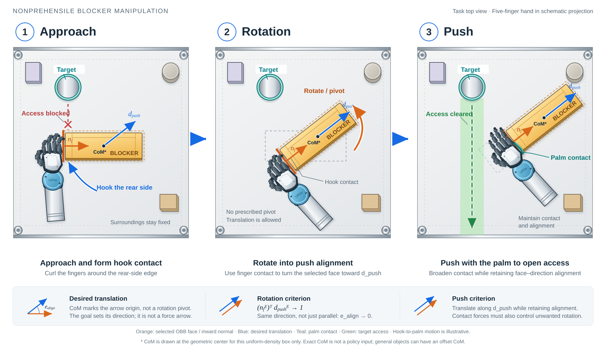

# Track B Policy Learning Specification

> **문서 역할**: Track B의 policy 학습 환경을 구현하기 위한 명세서이다.
>
> **현재 범위**: Task definition v0.3 + Observation v0.3 + Reward formulation v0.3 구조
>
> **상태**: working baseline — 확정된 방향과 실험으로 결정할 항목을 구분한다.
>
> **최종 갱신**: 2026-09-18

---

## 0. 이 문서를 읽는 방법

- [`README.md`](README.md): 전체 문서의 권장 독해 순서
- [`research_topic.md`](research_topic.md): 현재까지 구체화된 연구 주제와 전체 시스템 정의
- [`Intro/`](Intro/README.md): 연구 필요성, research trend, previous works와 candidate contribution
- [`papers/`](papers/README.md): 관련 논문 목록과 근거 검토
- [`context.md`](context.md): 논의 흐름, 결정 변경, 결정 근거의 기록
- **이 문서**: actor·critic·environment 구현에 직접 사용할 policy 학습 명세

Task definition v0.3과 Observation v0.3을 기준으로 reward용 privileged information과 reward formulation의 구조를 정리한다. 수치 weight·threshold와 curriculum·algorithm 설정은 근거 자료와 초기 rollout 통계를 확보한 뒤 확정한다.

이 문서는 다음 순서로 읽는다.

1. **1절:** policy가 해결할 task와 action의 의미
2. **2–4절:** actor가 무엇을 보고 각 신호를 어떻게 표현하는지
3. **5–8절:** observation을 실물과 맞추고 검증하는 방법
4. **9절:** actor에게 숨기고 학습 신호에만 사용할 정보
5. **10절:** task objective, phase shaping, safety와 regularization
6. **11절:** 구현 전에 남은 결정과 권장 구현 순서

### 0.1 현재 학습 명세 요약

| 항목 | Working baseline | 상태 |
| --- | --- | --- |
| Policy | Phase ID가 없는 shared MLP | Core |
| Actor observation | EEF-relative target position·push direction·selected-face normal, current object pose, OBB, arm·hand q, current 17D tactile, current wrist F/T, previous action | Core, 66D |
| Action | EEF-frame delta translation 3D + local rotation increment 3D + hand action 6D | Core, scale·controller 미결 |
| Task sequence | Approach / Contact Formation → Rotation / Pivoting → Push | Core, hard action masking 없음 |
| Approach objective | 후속 Rotation→Push가 가능한 wrist–hand configuration과 contact state 형성 | Core objective |
| Privileged information | Exact object/contact/collision/support/effort state | Reward·termination·evaluation only |
| Reward | Final success + phase shaping + aggregate-contact maintenance + safety constraint + action-rate regularization | v0.3, weight·threshold 미결 |

`Core`는 먼저 구현할 baseline이고, `Candidate`는 특정 failure가 확인되거나 ablation이 필요할 때 비교할 항목이다. 표의 결론을 먼저 이해한 뒤 아래 절에서 좌표계, 수식과 근거를 확인한다.

---

## 1. 현재 학습 문제의 전제

학습 입력을 정의하기 전에 policy가 무엇을 달성하고 어떤 command를 출력하는지 먼저 고정한다. 이 절의 task·action 정의가 다음 observation과 reward 설계의 기준이다.

### 1.1 Policy 구조

- 하나의 **shared MLP policy**가 Approach/Contact Formation → Rotation/Pivoting → Push를 수행한다.
- actor에게 **phase ID를 제공하지 않는다**.
- phase별 gate는 reward term의 활성도를 조절하지만 action을 차단하는 hard state machine은 아니다.
- gate가 policy observation으로부터 추론할 수 없는 hidden latched state를 갖지 않도록 한다.

### 1.2 Task goal의 의미

최종 목적은 물체를 임의의 목표 자세에 놓는 것이 아니라, **선택된 OBB 면으로 지정 방향을 안정적으로 밀어 목표 위치에 도달하는 것**이다. Rotation/Pivoting은 선택 면의 pushing normal을 지정 방향과 정렬하는 준비 과정이다. 목표 orientation quaternion은 task command가 아니며, 필요한 물체 자세는 `선택 면 + push direction`에서 유도된다.

Approach / Contact Formation의 목적도 단순히 물체에 가까워지거나 최초 접촉을 만드는 것이 아니다. **후속 Rotation과 Push를 연속적으로 수행할 수 있는 wrist–hand configuration과 hand–object contact state를 형성하는 것**이 Approach의 task-level objective다. 최초 hand–object contact 이후에는 aggregate contact를 가능한 한 유지하지만, 동일한 finger·taxel 접촉을 고정하지 않는다. 필요한 contact migration·release·re-contact와 작은 hand reconfiguration은 허용하며, 불필요한 재구성만 줄이는 것을 working hypothesis로 둔다.

목표 물체 위치는 task/world frame에서 다음과 같이 정의한다.

$$
\mathbf{p}_{O,g}^{W}
=
\mathbf{p}_{O,0}^{W}
+
s_{\mathrm{push}}\mathbf{d}_{\mathrm{push}}^{W}
$$

상위 모듈은 blocker, 목표 push direction·distance와 사용할 OBB lateral face를 제공한다고 가정한다. Object-local outward normal을 $\mathbf n_{f,\mathrm{out}}^O$라 할 때, 선택 면에서 물체 안쪽을 향하는 inward pushing normal은 $\mathbf n_f^O=-\mathbf n_{f,\mathrm{out}}^O$로 정의한다. 정책은 목표 위치, push direction과 현재 선택 면의 pushing normal을 EEF frame으로 받는다. Push direction은 목표 병진 방향이고, pushing normal은 coarse geometry의 방향이며, 실제 접촉력 방향은 접촉과 마찰에 의해 결정되는 별도 물리량이다.

Episode는 hand–object non-contact 상태에서 시작한다. 초기 wrist–hand pose와 blocker pose의 sampling 규칙은 아직 미결이지만, 초기·목표 상태와 회전 중 swept footprint는 shelf의 사용 가능 영역 안에 있어야 한다. Rotation 중 병진은 허용한다. 다만 object의 support footprint가 shelf 경계를 벗어나거나, robot/object가 pillar·다른 물체와 금지된 접촉을 만들면 safety violation이다. Object 바닥과 shelf support plane의 정상적인 지지 접촉은 허용한다.

선택 면은 episode 시작 시 고정한다. 매 frame OBB를 다시 fitting해 face identity를 재할당하지 않고, 초기 OBB frame과 object pose tracking으로 같은 object-local face label의 방향을 갱신한다. 현재 1단계에서는 face 선택을 상위 task generator의 역할로 두며, policy가 후보 면 중 하나를 고르는 문제는 후속 확장이다.

**Figure — Hook contact에서 palm pushing으로 이어지는 동작 예시.** 세 패널에서 target, surrounding objects와 shelf pillar의 위치는 같고, 조작 대상인 blocker와 robot hand만 움직인다. Approach는 비접촉 시작 이후 후면 모서리에 손가락을 걸어 접촉을 형성한 시점을, Rotation은 hook contact로 물체를 돌려 선택 면을 push direction에 정렬한 시점을 보여준다. Push에서는 넓은 손바닥 접촉으로 전환해 정렬을 유지하며 blocker를 이동시킨다. 여기서 후면은 목표 push direction의 반대쪽 측면을 뜻한다. 초록색 영역은 blocker 이동으로 열린 접근 공간이며, target retrieval 자체는 현재 low-level policy의 수행 범위에 포함하지 않는다.

회색 평면은 측벽 없는 shelf deck이며 네 모서리의 원형 부품은 pillar다. 파란 손목과 흰색 하우징·검은 손가락은 UR5e–RH56E2의 개념도다. [RH56E2 공식 제품 자료](https://en.inspire-robots.com/product/rh56e2/)를 참고해 네 손가락의 링크·관절과 별도의 엄지를 구분했으며, 손은 접촉 관계를 설명하기 위한 도식적 투영으로 표현했다. 실제 CAD/URDF 렌더링이나 관절각의 정확한 투영은 아니다. Hook-to-palm 순서는 접촉 변화의 예시로서, 정확한 hand pose의 실행 가능성과 효과는 URDF·joint limit 및 rollout으로 검증해야 한다. 모든 손가락이 물체에 닿는 배치를 의미하지 않으며, 특정 hook이나 다섯 손가락의 동시 접촉을 reward의 필수 조건으로 확정하지 않는다. Object–support-plane 접촉은 허용하고, robot/blocker와 pillar·비표적 물체의 접촉은 현재 baseline에서 금지한다. 주변 물체의 수·배치는 예시이며 randomization 설정을 확정하는 그림은 아니다.

주황색 점선은 approximate OBB, 굵은 주황색 선은 episode 동안 동일하게 추적하는 selected face다. 주황색 화살표는 이 면의 **inward pushing normal**, 파란색 화살표는 **commanded push direction**이다. 그림에서 파란 화살표는 물체의 **CoM에서 시작**해 목표 병진 방향을 나타낸다. 방향 자체는 상위 task goal로 정해지며 CoM 위치만으로 결정되지 않는다. 그림의 균일한 상자에서는 설명을 위해 CoM과 기하 중심을 일치시켰으나, 일반 물체의 CoM은 OBB 중심과 다를 수 있다. 실제 CoM은 actor observation에 추가하지 않고 기존 privileged-information 구분을 유지한다.

두 화살표는 실제 contact-force 측정값을 뜻하지 않으며 selected face도 정확한 mesh contact patch가 아닌 coarse task label이다. 선택 면의 outward normal 반대 방향을 $\mathbf n_{f,t}^{E}$로 정의하면 Rotation의 정렬 기준은

$$
c_{\mathrm{align},t}
=
(\mathbf n_{f,t}^{E})^{\mathsf T}\mathbf d_{\mathrm{push},t}^{E}
=
\cos e_{\mathrm{align},t}
\rightarrow 1
$$

이다. 이는 $e_{\mathrm{align},t}\rightarrow0$과 같으며, 두 unit vector가 **같은 방향**을 향하도록 정렬한다는 뜻이다. Figure의 평면상 화살표는 공통 shelf/task frame으로 그렸고, actor에서는 두 벡터를 매 step 현재 EEF frame으로 변환한다. 같은 회전 변환을 적용하므로 두 벡터의 내적과 정렬각은 변하지 않는다. Push 중에도 이 관계와 aggregate contact를 유지하면서 목표 위치로 병진한다.

그림은 이해를 위한 세 snapshot이며 **CoM을 중심으로 회전하도록 요구하지 않는다.** CoM은 목표 병진 방향 화살표를 표시하는 기준점일 뿐 회전축이 아니다. Rotation의 목적은 selected-face normal과 push direction의 정렬이며, CoM 고정이나 지정 pivot 경로 추종을 성공 조건에 넣지 않는다. 접촉 상태에 따라 회전 중심이 달라지거나 이동할 수 있고, Rotation 중 병진과 필요한 contact migration·reconfiguration도 허용한다. 이를 나타내기 위해 Rotation 패널은 초기 점선 OBB와 비교해 orientation과 중심 위치가 모두 변한 snapshot으로 그렸다. 특정 고정 pivot이나 고정 hand pose를 지정한 궤적은 아니다. Initial alignment가 이미 적합하면 Rotation을 생략할 수 있다. 세 단계는 task-level progress 순서이며 phase ID 제공이나 hard action switching을 의미하지 않는다. 정확한 alignment success threshold는 reward·evaluation threshold calibration 이후 확정한다.

면 정렬은 병진을 위한 기하학적 조건이며, 순수 병진을 보장하는 충분조건은 아니다. 접촉력 $\mathbf f_i$가 CoM에 만드는 모멘트는 $(\mathbf p_i-\mathbf p_{\mathrm{CoM}})\times\mathbf f_i$이므로, 여러 finger·palm 접촉의 힘 분배와 shelf의 지지·마찰 반력까지 함께 고려해야 한다. [Adaptive Reaching and Pushing](https://doi.org/10.3389/fnbot.2023.1271607)의 §3.3은 목표 방향에 대한 force alignment와 CoM에 대한 force-line lever arm 감소를 별도로 보상한다. 본 연구에서도 hook-to-palm 전환이 불필요한 회전을 줄이는지는 실제 orientation drift·접촉력·성공률로 검증하며, CoM 관련 force shaping은 기존 Candidate 상태를 유지한다.

### 1.3 Action과 previous action의 의미

현재 action interface는 다음 12차원을 전제로 한다.

$$
\mathbf{a}_t
=
[\Delta\mathbf{p}^{E}_t,\;\Delta\boldsymbol{\phi}^{E}_t,\;\mathbf{a}^{H}_t]
\in \mathbb{R}^{12}
$$

- EEF-frame delta translation: 3D
- EEF-frame local rotation increment: 3D
- RH56E2 hand joint action: 6D

매 policy step의 **측정된 현재 EEF 상태**를 기준으로 DiffIK 또는 OSC의 새 목표를 만든다. 이전 desired target에 새 delta를 계속 누적하지 않는다. 따라서 controller target state는 observation에 포함하지 않는다.

---

## 2. Observation 설계 원칙

위 task를 수행하려면 actor가 목표, 현재 물체–손 관계, robot configuration과 실제 접촉 반응을 구분해서 보아야 한다. 동시에 simulation에서만 얻을 수 있는 정확한 정보에 의존해서는 안 된다. 이 두 요구를 다음 원칙으로 구체화한다.

1. **실물에서 얻을 수 있는 actor input만 사용한다.** 시뮬레이터의 정확한 contact force, collider identity, 물체 동역학 파라미터 등은 actor에게 노출하지 않는다.
2. **대부분의 task-space 정보를 EEF frame으로 통일한다.** 로봇과 물체가 함께 이동할 때 불필요한 world-coordinate 의존성을 줄인다.
3. **Task command와 current state를 구분한다.** 목표 위치·push direction은 command이고, 선택 면 normal·현재 object pose는 그 명령에 대한 현재 상태다.
4. **MLP에 필요한 시간 정보는 observation vector에 명시적으로 펼쳐 넣는다.** 별도의 암묵적 memory가 있다고 가정하지 않는다.
5. **현재값으로 충분한 센서에는 history를 관성적으로 추가하지 않는다.** Binary tactile과 wrist F/T는 current observation으로 시작하고, 직전 action만 1-step 제공한다.
6. **필요성이 확인되지 않은 파생 정보는 먼저 제외한다.** 실패 원인이나 ablation 근거가 생겼을 때 추가한다.
7. **actor observation과 reward용 privileged information의 경계를 유지한다.** reward가 더 정확한 시뮬레이션 정보를 사용하더라도 actor가 그것에 의존하지 않도록 한다.

---

## 3. Observation v0.3

2절의 원칙을 실제 66D tensor로 고정한 결과가 아래 표다. 이 절은 **무엇을 넣는지**를 보여주고, 4절은 **각 값을 어떻게 계산하는지**를 설명한다.

### 3.1 전체 구성표

| ID | Observation | 실물 정보원 | Frame·표현 | 시간 범위 | 차원 | 상태 및 포함 이유 |
|---|---|---|---|---:|---:|---|
| O1 | 목표 물체 position $\mathbf{p}_{O,g,t}^{E}$ | 상위 task command + EEF pose | EEF frame, Cartesian | 현재 | 3 | **Core**. 최종 이동 위치와 lateral deviation 판단 |
| O2 | 목표 push direction $\mathbf{d}_{\mathrm{push},t}^{E}$ | 상위 task command + EEF pose | EEF frame, unit vector | 현재 | 3 | **Core**. Task/world frame에서 고정한 목표 이동 방향·면 정렬 기준을 매 step EEF frame으로 변환 |
| O3 | 선택 면의 현재 pushing normal $\mathbf{n}_{f,t}^{E}$ | 선택 face + object pose + EEF pose | EEF frame, inward unit normal | 현재 | 3 | **Core**. Rotation alignment와 Push 중 정렬 유지 판단 |
| O4 | 현재 object position $\mathbf{p}_{EO,t}^{E}$ | vision tracker | EEF frame, Cartesian | 현재 | 3 | **Core**. 현재 object–EEF 관계 |
| O5 | 현재 object orientation $\overline{\mathbf{q}}_{EO,t}$ | vision tracker | EEF frame, canonical unit quaternion | 현재 | 4 | **Core**. 현재 3D 자세·tilt와 OBB 축 방향 표현 |
| O6 | Object OBB extent $\mathbf{d}_{O}$ | 초기 perception/template | object-local $(l,w,h)$ | episode 고정 | 3 | **Core**. point cloud 없이 물체 크기 차이를 제공 |
| O7 | UR5e joint position $\mathbf{q}^{A}_t$ | joint encoder | joint coordinates | 현재 | 6 | **Core**. arm configuration과 관절 한계·특이점 관련 상태 |
| O8 | RH56E2 actuated joint position $\mathbf{q}^{H}_t$ | joint encoder | joint coordinates | 현재 | 6 | **Core**. hand configuration과 접촉 형상 상태 |
| O9 | Binary tactile $\mathbf{b}_t$ | RH56E2 tactile sensor | sensor index가 고정된 17D on/off vector | 현재 | 17 | **Core**. 실물과 simulation의 접촉 표현 차이를 줄이면서 접촉 위치 identity를 보존 |
| O10 | Wrist wrench $\widetilde{\mathbf{w}}_t$ | wrist F/T sensor | EEF frame, force 3 + torque 3 | 현재 | 6 | **Core**. 현재 하중 방향·크기·moment 제공 |
| O11 | Previous action $\mathbf{a}_{t-1}$ | policy output log | 1.3절과 같은 정규화 표현 | 직전 1 step | 12 | **Core**. 직전 명령과 현재 robot/contact response의 관계 제공 |

Tactile 17개 channel의 순서는 RH56E2 sensor index와 simulation의 대응 sensor region 사이에서 고정한다. Coarse pooling은 baseline이 아니라 sensor-granularity ablation으로만 남긴다.

### 3.2 Actor 입력 순서와 차원

배치 내부의 observation 순서는 다음과 같이 고정한다.

$$
\begin{aligned}
\mathbf{o}_t = [&\mathbf{p}_{O,g,t}^{E},
\mathbf{d}_{\mathrm{push},t}^{E},
\mathbf{n}_{f,t}^{E},
\mathbf{p}_{EO,t}^{E},
\overline{\mathbf{q}}_{EO,t},
\mathbf{d}_{O},\\
&\mathbf{q}^{A}_t,
\mathbf{q}^{H}_t,
\mathbf{b}_t,
\widetilde{\mathbf{w}}_t,
\mathbf{a}_{t-1}]
\end{aligned}
$$

전체 입력 차원은 다음과 같다.

$$
D_{\mathrm{MLP}}
=
31 + 17 + 6 + 12
=66
$$

여기서 31D는 task command·selected-face state 9D, current object pose 7D, OBB extent 3D, arm q 6D와 hand q 6D의 합이다. Tactile·wrench history는 observation 차원을 늘리지 않으며 previous action은 직전 1-step만 사용한다.

---

## 4. Observation 항목별 구현 명세

### 4.1 Task command, selected-face state와 current object pose

World/task frame에서 고정된 목표 위치와 push direction을 **매 policy step 현재 EEF frame으로 다시 표현**한다.

$$
\mathbf{p}_{O,g,t}^{E}
=
\mathbf{R}_{WE,t}^{\mathsf{T}}
(\mathbf{p}_{O,g}^{W}-\mathbf{p}_{WE,t}^{W})
$$

$$
\mathbf{d}_{\mathrm{push},t}^{E}
=
\mathbf{R}_{WE,t}^{\mathsf{T}}\mathbf{d}_{\mathrm{push}}^{W}
$$

현재 object pose와 선택 면의 pushing normal은 다음과 같이 계산한다.

$$
\mathbf{p}_{EO,t}^{E}
=
\mathbf{R}_{WE,t}^{\mathsf{T}}
(\mathbf{p}_{WO,t}^{W}-\mathbf{p}_{WE,t}^{W}),
\qquad
\mathbf{q}_{EO,t}
=
(\mathbf{q}_{WE,t})^{-1}\otimes\mathbf{q}_{WO,t}
$$

$$
\mathbf{n}_{f,t}^{E}
=
\mathbf{R}_{WE,t}^{\mathsf{T}}
\mathbf{R}_{WO,t}\mathbf{n}_{f}^{O},
\qquad
\mathbf{n}_{f}^{O}=-\mathbf{n}_{f,\mathrm{out}}^{O}.
$$

EEF-relative command를 episode 시작 시 한 번 계산한 뒤 고정하면 EEF 이동과 함께 world상의 목표가 변하는 잘못된 문제가 생긴다. 고정되는 것은 $\mathbf{p}_{O,g}^{W}$, $\mathbf{d}_{\mathrm{push}}^{W}$와 object-local face identity이며, EEF 표현은 계속 갱신한다.

목표 position과 push direction을 모두 주는 이유는 역할이 다르기 때문이다. 목표 position은 최종 도달과 lateral correction을 정의하고, push direction은 물체가 경로에서 벗어나도 유지해야 하는 원래 경로축과 면 정렬 기준을 보존한다. 선택 면 normal은 quaternion과 extent만으로는 알 수 없는 `어느 면을 사용할 것인가`를 MLP에 직접 전달한다.

Task 성공과 reward는 목표 quaternion이 아니라 선택 면의 pushing normal과 push direction 사이의 alignment를 평가한다. EEF-frame quaternion은 current object pose 표현이며, task가 임의의 full SO(3) 목표 자세 제어를 요구한다는 뜻은 아니다.

Quaternion은 $\mathbf{q}$와 $-\mathbf{q}$가 같은 회전을 나타내므로 raw tracker output을 그대로 넣지 않는다. Unit normalization 후 scalar component가 음수이면 부호를 뒤집는 canonicalization을 적용한다.

$$
\overline{\mathbf{q}}
=
\begin{cases}
\mathbf{q}/\|\mathbf{q}\|, & q_s\ge0\\
-\mathbf{q}/\|\mathbf{q}\|, & q_s<0
\end{cases}
$$

현재 [Isaac Lab](https://doi.org/10.48550/arXiv.2511.04831) math API의 `quat_unique`도 같은 방식으로 quaternion의 real part를 non-negative로 표준화한다. 다만 Isaac Lab version에 따라 serialized component order가 `(w,x,y,z)` 또는 `(x,y,z,w)`일 수 있으므로, policy tensor의 순서는 설치 version을 확인한 뒤 sim–real adapter 양쪽에서 명시적으로 고정한다. Quaternion noise는 네 component에 독립적인 additive noise를 넣기보다 작은 rotation quaternion을 곱하는 방식으로 적용한다.

[Isaac Lab Gear Assembly sim-to-real example](https://isaac-sim.github.io/IsaacLab/v3.0.0-beta2/source/policy_deployment/02_gear_assembly/gear_assembly_policy.html)은 vision에서 얻은 shaft orientation을 4D quaternion으로 policy에 직접 제공한다. 따라서 4D quaternion은 구현 일관성과 낮은 차원 면에서 적절한 baseline이다. 다만 $180^\circ$ 부근의 canonical-sign 경계에서 학습 불안정이 확인되면 [Zhou et al.의 rotation 6D](https://doi.org/10.1109/CVPR.2019.00589)를 representation ablation으로 비교한다. Quaternion의 raw Euclidean 차이는 reward의 orientation error로 사용하지 않는다.

### 4.2 Object geometry: OBB extent

- actor에는 raw RGB, point cloud, mesh를 넣지 않는다.
- OBB extent $(l,w,h)$는 object-local canonical axes 기준으로 정렬한다.
- episode 시작 시 선택한 template의 축과 extent를 고정하고, 이후에는 pose만 tracking한다.
- 현재 object orientation O5가 object-local 축의 EEF-frame 방향을 제공하더라도 선택 face identity는 알 수 없으므로, 선택 면의 current pushing normal O3는 task-conditioned state로 명시한다. 다른 OBB axis vector나 corner는 추가하지 않는다.
- 선택 face는 초기 OBB의 lateral face 중 하나로 제한하고 episode 동안 같은 object-local face label을 추적한다. 매 frame OBB fitting 결과의 axis permutation·sign으로 face identity를 다시 정하지 않는다.
- OBB face는 실제 mesh surface patch가 아니라 접근할 물체 측면과 pushing normal을 지정하는 coarse task label이다. 실제 접촉 위치·법선·곡률의 차이는 actor의 tactile·wrist F/T와 privileged evaluation에서 다룬다.
- 대칭 물체는 symmetry-equivalent orientation 중 이전 추정과 가장 연속적인 해를 택한다. Quaternion canonicalization 자체가 OBB axis swap 문제를 해결하지는 않는다.

Point cloud 기반 정책인 [CORN](https://doi.org/10.48550/arXiv.2403.10760)과 [HACMan](https://doi.org/10.48550/arXiv.2305.03942)은 geometry와 contact/action 위치의 결합이 핵심이다. 본 연구는 가려짐이 큰 shelf 환경과 실물 추정 안정성을 우선하여 OBB까지만 사용하며, surface-level geometry awareness를 주장하지 않는다.

### 4.3 Arm·hand proprioception

- UR5e의 measured joint position 6D와 RH56E2의 actuated joint position 6D를 포함한다.
- joint velocity는 초기 observation에서 제외한다.
- absolute EEF pose/twist와 fingertip·pad center position은 joint state 및 EEF-relative task state와 중복될 수 있어 제외한다.
- action을 주었는데 hand가 물체나 선반에 막혀 움직이지 못하는 현상을 현재 $\mathbf{q}^{H}_t$만으로 충분히 구분하지 못하면, hand joint history 또는 velocity를 ablation으로 추가한다.

### 4.4 Binary tactile

Actor의 tactile은 **접촉 상대를 구분하지 않는 any-contact 신호**이다. 물체, 선반 또는 다른 collider와 접촉해도 같은 region의 contact는 1이다. 접촉 상대의 identity는 reward/termination 계산에만 쓰는 privileged information으로 분리한다.

각 sensor region의 contact-force magnitude $f_{i,t}$는 하나의 activation threshold $\tau_{\mathrm{tac}}$로 이진화한다.

$$
b_{i,t}=\mathbb{1}\!\left[f_{i,t}\ge \tau_{\mathrm{tac}}\right]
$$

- On/off에 서로 다른 threshold를 두거나 직전 binary state를 유지하는 hysteresis는 구현하지 않는다.
- $\tau_{\mathrm{tac}}$의 수치는 아직 확정하지 않는다. [DexTouch](https://doi.org/10.1109/LRA.2024.3478571), [Rotating without Seeing](https://doi.org/10.15607/RSS.2023.XIX.036)과 [VTDexManip](https://openreview.net/forum?id=jf7C7EGw21)의 simulation 설정인 $0.01\,\mathrm{N}$은 초기 참고값이며, 최종값은 [Isaac Lab](https://doi.org/10.48550/arXiv.2511.04831) contact 출력과 실제 RH56E2 신호 분포를 확인한 뒤 정한다.
- 실물 sensor가 내부적으로 filtering된 신호를 제공하는지 확인하되, policy용 binary 변환 자체에는 시간 상태를 갖는 hysteresis를 추가하지 않는다.
- taxel마다 별도의 rigid collision body를 만드는 방식은 병렬 RL의 계산량 때문에 baseline에서 제외한다.
- URDF의 접촉 가능 link/pad 또는 고정된 sensor region을 실물 17채널과 일대일 대응시켜 $\mathbf{b}_t\in\{0,1\}^{17}$을 만든다.
- **17채널 current vector를 baseline**으로 사용하고, coarse pooling은 정보량을 줄이는 ablation으로만 비교한다.
- Sensor index 순서는 episode나 contact 상대에 따라 바뀌지 않는다.

Binary contact와 force sensing을 정책 입력으로 사용하는 선행 사례는 [DexTouch](https://doi.org/10.1109/LRA.2024.3478571), [Rotating without Seeing](https://doi.org/10.15607/RSS.2023.XIX.036), [Tactile Pushing](https://doi.org/10.1109/LRA.2023.3295236)을 참고한다. [DexTouch](https://doi.org/10.1109/LRA.2024.3478571)는 16D current binary tactile를 history 없이 사용했고, binary signal을 sim–real 차이를 줄이기 위한 표현으로 채택해 zero-shot real transfer를 보였다. 실물 평가에서 tactile를 비활성화한 정책보다 full tactile policy의 성공률이 크게 높았지만, 이는 **binary가 continuous tactile보다 우월하다는 단독 인과 증거**가 아니라 tactile feedback과 sim–real-compatible representation의 결합 효과로 해석한다. 반대로 [Rotating without Seeing](https://doi.org/10.15607/RSS.2023.XIX.036)은 4-step state stack을 사용했으므로 tactile history가 항상 불필요하다고 일반화하지 않는다.

### 4.5 Wrist F/T

Wrist wrench는 bias를 제거하고 EEF frame으로 표현한다.

$$
\widetilde{\mathbf{w}}_t^E
=
[\widetilde{\mathbf{f}}_t^E,\;\widetilde{\boldsymbol{\tau}}_t^E]
\in\mathbb{R}^{6}
$$

Binary tactile은 접촉 위치를 알려주지만 접촉의 강도와 방향을 잃는다. Wrist F/T는 전체 하중의 방향·크기·moment를 보완하지만 어느 tactile region에 힘이 작용했는지는 알려주지 못한다. 따라서 두 modality는 대체 관계가 아니라 상보 관계이다.

정확한 gravity/inertia compensation, clipping, filtering, normalization은 실제 sensor log와 control rate를 확인하면서 학습 환경 구현 단계에서 정한다. Wrist force feedback의 역할은 [Force Push](https://doi.org/10.1109/LRA.2024.3414180)와 [RoboPack](https://doi.org/10.15607/RSS.2024.XX.130)을 참고하되, 이들이 사용한 temporal inference가 우리 current-wrench baseline에 자동으로 필요하다고 간주하지 않는다.

### 4.6 Current sensor input과 1-step previous action

Baseline MLP에는 tactile과 wrench의 과거 frame을 concatenate하지 않는다.

- tactile: 현재 $\mathbf{b}_t$ 17D
- wrist F/T: 현재 $\widetilde{\mathbf{w}}_t$ 6D
- previous action: 직전 $\mathbf{a}_{t-1}$ 12D

직전 action은 [Isaac Lab](https://doi.org/10.48550/arXiv.2511.04831)의 `last_action` observation term과 같은 의미다. 본 연구의 action은 이전 desired target에 누적되지 않지만, $\mathbf{a}_{t-1}$은 현재 measured state와 접촉 반응이 어떤 직전 명령 뒤에 발생했는지를 MLP가 구분하도록 돕는다. 두 step 이상의 action stack은 baseline에서 사용하지 않는다. Reset 직후 $\mathbf{a}_{t-1}$은 0으로 초기화한다.

Current-only sensor 입력을 채택하는 이유는 다음과 같다.

1. 17D tactile 자체가 sensor별 contact identity를 제공하고, continuous vision과 current robot configuration도 함께 관측한다.
2. 입력 차원과 시간 정렬 부담을 줄여 sim–real interface를 단순하게 유지한다.
3. [DexTouch](https://doi.org/10.1109/LRA.2024.3478571)처럼 current binary tactile만으로 실물 전이가 가능했던 직접 사례가 있다.

Sensor history를 제거하는 것과 실제 장치가 제공하는 내부 filtering은 구분한다. 그러나 policy용 binary tactile은 매 시점의 sensor 값에 단일 threshold를 적용하며 hysteresis를 사용하지 않는다. 접촉의 진입·이탈 방향, slip 전조 또는 delayed wrench response를 현재값과 직전 action만으로 구분하지 못하는 실패가 확인될 때에만 short tactile/wrench history를 ablation으로 추가한다.

---

## 5. Observation 전처리와 Sim-to-Real 기준

4절의 값은 simulation에서 바로 읽을 수 있지만, actor가 실물에서도 같은 의미의 신호를 받아야 한다. 따라서 이 절에서는 정규화, perception corruption과 sensor-rate 차이를 실물 interface에 맞추는 방법을 정한다.

### 5.1 정규화 원칙

| 항목 | Working rule | 수치 결정 시점 |
|---|---|---|
| EEF-relative position | 학습 workspace bound로 scale·clip | workspace 설계 시 |
| Push direction·face normal | Unit normalization; sim–real axis convention 고정 | task interface 검증 시 |
| Quaternion | unit normalization + canonical sign; component order 고정 | Isaac Lab version 확인 시 |
| OBB extent | 학습 물체 크기 범위로 scale | object set 확정 시 |
| Arm·hand joint | joint limit 기준 정규화 | URDF 검증 시 |
| Binary tactile | 단일 threshold로 이진화한 0/1 유지; hysteresis 없음 | threshold 수치는 sensor 검증 시 |
| Wrist F/T | bias 보정 후 robust bound로 clip·scale | 실물 sensor log 수집 시 |
| Previous action | policy action space와 동일한 normalized value | action scaling 확정 시 |

### 5.2 Vision/OBB 입력의 현실화

Vision tracking 자체의 개선은 본 연구 범위가 아니다. Core training에서는 ground-truth object pose를 tracker output의 proxy로 사용할 수 있지만, policy가 완벽한 pose에만 의존하지 않도록 다음 corruption을 실제 tracker 통계에 맞춰 적용한다.

- position·orientation noise와 bias
- latency와 낮은 update rate
- 짧은 hold/dropout
- 드문 outlier
- OBB symmetry에 따른 axis ambiguity

목표 command와 선택 face가 초기 object estimate에서 생성된다면 초기 perception bias가 goal, current pose와 face normal에 일관되게 반영되어야 한다. 이들에 매 step 서로 독립적인 noise를 주어 존재하지 않는 alignment error를 만드는 방식은 피한다. 선택 face identity는 유지하고 pose corruption을 통해 face normal이 함께 변하도록 한다. Vision confidence와 마지막 update 이후 시간은 core observation에 넣지 않으며, 실제 tracker가 해당 metadata를 제공하고 recovery behavior가 연구 범위에 들어갈 때만 deployment option으로 검토한다. Visuotactile state estimation의 역할 구분은 [Visuotactile Estimation and Control](https://doi.org/10.48550/arXiv.2412.13157)을 참고한다.

### 5.3 Sensor rate가 policy rate보다 빠를 때

Baseline에서는 각 policy tick에 동기화한 최신 single-threshold 17D tactile state와 최신 filtered wrist wrench를 사용한다. 이는 과거 frame을 actor에 stack하지 않는다는 뜻이다. 짧은 접촉을 놓치는 현상이 확인되면 observation history를 추가하기 전에 다음 interval aggregation을 비교한다.

- tactile: policy interval 내부의 contact OR/latch
- F/T: interval의 mean, peak 또는 impulse summary

이러한 summary를 추가할 때도 sim과 real에서 동일한 시간 window와 연산을 사용한다.

---

## 6. Observation 범위의 경계

Baseline을 작고 배포 가능하게 유지하려면 포함 항목뿐 아니라 제외 항목도 명시해야 한다. 아래 정보는 중복되거나 실물에서 안정적으로 얻기 어렵기 때문에 현재 actor에서 제외하며, 실패 근거가 생길 때만 다시 검토한다.

| 제외 항목 | 현재 판단 | 필요 시 검토할 조건 |
|---|---|---|
| Phase ID | 제공하지 않음 | 본 연구의 핵심 가정이 바뀌는 경우에만 |
| Shelf/workspace state | 제공하지 않음 | clearance ambiguity가 주된 실패 원인일 때 |
| Object linear/angular velocity | noisy finite difference를 피하기 위해 제외 | pose history가 실제로 필요하다는 실패 근거가 있을 때 |
| Arm·hand joint velocity | current joint state로 시작 | action-response mismatch가 구분되지 않을 때 |
| Absolute EEF pose/twist | EEF-relative task state와 중복 가능 | 관절 state만으로 제어 제약을 설명하지 못할 때 |
| Fingertip/pad Cartesian position | hand joint와 tactile에 중복 가능 | geometry/contact attribution 실패가 확인될 때 |
| Vision confidence/age | tracker 개선이 연구 범위가 아님 | deployment recovery를 명시적으로 다룰 때 |
| Raw image, point cloud, mesh | occlusion과 sim-to-real 안정성 우선 | geometry-aware variant를 별도 비교할 때 |
| Controller desired target | action이 이전 target에 누적되지 않음 | controller interface 자체가 바뀔 때 |
| 정확한 contact force·normal·pair | privileged information으로만 사용 | actor에 넣지 않음 |
| Tactile·wrench history | current sensor input으로 시작 | contact transition·slip·delay를 구분하지 못하는 실패가 확인될 때 |

Shelf geometry를 actor에게 주지 않는 대신 privileged collision·support state로 shelf 이탈과 금지 접촉을 제약한다. 현재 shelf는 측벽 없이 pillar와 support plane으로 구성된다. Object–support-plane 접촉은 허용하고, robot–structure와 object–pillar/other-object contact는 금지한다. Shelf clearance가 다른 두 상태가 actor에게 완전히 같은 observation으로 보일 수 있으므로 초기 연구에서는 shelf와 robot base의 상대 배치를 고정하고, initial–goal path와 rotation swept footprint가 안전 여유를 갖는 task만 sampling한다. 실제 시스템의 안전 감시는 policy observation과 별개의 safety layer로 둔다.

---

## 7. Observation ablation

6절에서 제외한 후보 중 연구 결론에 직접 영향을 줄 수 있는 항목은 제거한 채로 끝내지 않고 다음 비교를 통해 필요성을 검증한다.

| 질문 | Baseline | 비교안 | 해석 목적 |
|---|---|---|---|
| Current orientation 표현은 충분한가? | EEF-relative quaternion 4D | rotation 6D | 저차원 구현과 sign-boundary의 trade-off |
| 선택 face 표현이 필요한가? | Current EEF-frame pushing normal 3D | object-local face one-hot + quaternion; face normal 제거 | MLP에 task-relevant alignment를 직접 제공하는 이점 검증 |
| Tactile 공간 해상도는 필요한가? | full 17-channel | coarse pooling; F/T only | 접촉 위치 정보와 sim–real 구현 비용의 trade-off |
| Sensor history가 필요한가? | tactile·wrench current-only | modality별 short stack | partial observability 개선이 추가 차원을 정당화하는지 확인 |
| Previous action이 필요한가? | 1-step $\mathbf{a}_{t-1}$ | 제거; 2-step 이상 stack | action–response 추론에 대한 최소 action memory의 기여 |
| Binary tactile와 F/T가 상보적인가? | 둘 다 사용 | tactile only; F/T only | 각 modality의 독립 기여 검증 |
| OBB extent가 필요한가? | 3D extent 사용 | 제거 | unseen object 크기 일반화에 기여하는지 확인 |
| Joint velocity/history가 필요한가? | 제외 | $\dot{\mathbf{q}}$ 또는 short $\mathbf{q}$ history | 접촉 중 stuck/compliance 상태 판별 기여 |

Rotation 6D는 quaternion의 antipodal sign과 $180^\circ$ 부근 경계가 실제 학습 실패로 나타날 때 우선 비교한다. Task goal은 목표 quaternion이 아니므로 planar target-yaw encoding은 현재 goal representation ablation에서 제외한다.

---

## 8. Observation 구현 검증 항목

Observation 설계는 차원만 맞는다고 완료되지 않는다. Sim과 real에서 각 항목의 물리적 의미, 좌표계와 timestamp가 같아야 하므로 다음 항목을 학습 전 자동·수동 검증한다.

- [ ] Sim과 real에서 각 observation의 source, 단위, axis convention이 대응한다.
- [ ] Position과 orientation transform을 hand calculation과 단위 test로 검증한다.
- [ ] World/task target position·push direction과 object-local face identity는 고정되고 EEF-relative 표현만 매 step 변한다.
- [ ] Quaternion의 component order, multiplication convention, unit norm과 canonical sign이 sim/real에서 같다.
- [ ] OBB extent, 축과 selected-face identity가 episode 중 swap되지 않는다.
- [ ] Selected-face pushing normal과 push direction이 정렬될 때 alignment error가 0인지 검증한다.
- [ ] Any-contact semantics가 collider 종류와 무관하게 동일하다.
- [ ] Actor tensor에 contact pair, 정확한 force, shelf collision flag 등 privileged 정보가 섞이지 않는다.
- [ ] Current tactile·wrench의 sensor timestamp와 policy timestamp가 일치하고, $\mathbf{a}_{t-1}$이 정확히 직전 policy action이다.
- [ ] Batch observation 순서와 $D_{\mathrm{MLP}}$를 자동 test한다.
- [ ] Phase ID 없이도 reward gate의 상태를 현재 observation으로 추론할 수 있는지 확인한다.

---

## 9. Reward·termination용 privileged information v0.1

앞 절까지는 deployment 시 actor가 실제로 받을 정보였다. 이제 task progress와 안전 위반을 정확하게 계산하기 위해 simulation에서만 사용하는 교사 정보를 분리한다. 이 경계가 유지되어야 reward가 정확하더라도 actor는 실물에서 얻을 수 없는 신호에 의존하지 않는다.

Actor observation에 넣지 않더라도 simulation에서는 reward, constraint·termination과 evaluation을 정확하게 계산하기 위해 다음 정보를 사용할 수 있다. `privileged`라는 이유만으로 모두 asymmetric critic에 넣는 것은 아니다. critic 입력은 reward 명세 이후 별도로 결정한다.

| ID | Privileged information | Simulation source | 우선 용도 | Actor와의 경계 |
|---|---|---|---|---|
| P1 | Ground-truth object pose | rigid-body state | face alignment·translation progress, success | Actor는 tracker-corrupted pose만 사용 |
| P2 | Ground-truth object linear/angular velocity | rigid-body state | drift·toppling·stability 판정 | Actor baseline에서는 velocity 제외 |
| P3 | Hand–object contact pair·point·normal | contact report | desired contact, contact loss, force 작용선 | Actor tactile은 상대를 구분하지 않는 17D any-contact |
| P4 | Hand–object contact force·impulse | contact report | force direction, overload·impact | Actor에는 binary tactile와 measured wrist F/T만 제공 |
| P5 | Robot/object–pillar·shelf structure·other-object와 self-contact pair, force·impulse | contact report | forbidden collision cost·termination | Structure geometry·collision flag는 actor에서 제외 |
| P6 | Object–support-plane contact, support footprint와 shelf usable boundary | contact report + rigid-body state | support 유지·shelf 이탈·fall 판정 | 정확한 support polygon·boundary는 actor에 제공하지 않음 |
| P7 | Object CoM·roll/pitch·height | asset property + rigid-body state | lever arm, balance·fall 판정 | CoM과 정확한 inertial property는 actor에서 제외 |
| P8 | Joint position·velocity·applied effort와 limits | articulation state | joint·velocity·effort constraint | Actor에는 current joint position만 제공 |
| P9 | Applied action과 직전 action | action manager | action-rate regularization | 직전 action 1-step은 actor에도 제공 |

다음 원칙을 적용한다.

1. Ground-truth 정보는 **학습 신호를 정확히 계산하기 위한 교사 정보**이며 deployment 입력이 아니다.
2. Reward gate는 episode counter나 actor가 전혀 복원할 수 없는 hidden latch를 사용하지 않는다. Current object pose, 접촉과 목표 오차의 함수로 매 step 다시 계산한다.
3. 정확한 per-contact force distribution을 특정 정답으로 강제하지 않는다. Force direction, 과부하와 충격처럼 실물 F/T·tactile 반응과 연결되는 물리적 결과를 우선 평가한다.
4. Reward 계산용 exact pose와 evaluation용 tracker-corrupted pose의 metric을 둘 다 기록해 perception gap을 분리한다.

---

## 10. Reward formulation v0.3 — 구조

Reward는 `좋아 보이는 항을 모두 더하는 식`으로 구성하지 않는다. 먼저 최종 task 성공을 정의하고, 그 성공을 찾기 위한 phase shaping, 상쇄되어서는 안 되는 safety constraint, 작은 control regularization을 차례로 분리한다. 특히 Approach의 목적은 최초 접촉이 아니라 downstream-ready configuration이며, OBB distance는 그 목적을 찾기 위한 보조 신호일 뿐이다.

### 10.1 두 분류가 아니라 네 층으로 분리한다

`phase별 reward + 그 외 penalty`의 두 묶음만 두면 안전 위반이 큰 task reward로 상쇄될 수 있고, task 수행을 위한 shaping과 단순 제어 regularization의 역할도 섞인다. 현재 구조는 다음 네 층이다.

| 층 | 역할 | 학습 신호에서의 처리 |
|---|---|---|
| Final task objective | 선택 면을 push direction에 정렬·유지하며 목표 위치까지 이동 | Sparse success bonus와 성공 termination |
| Phase-specific shaping | Approach, Rotation, Push의 탐색 난이도를 낮춤 | Current-state gate가 활성화하는 dense reward |
| Safety constraint | 충돌, 전도, 과부하, 관절 한계 등 상쇄되어서는 안 되는 조건 | Cost, hard/stochastic termination, 실제 safety supervisor |
| Control regularization | 진동·불필요한 명령을 줄이되 task보다 우선하지 않음 | 작은 penalty와 ablation |

[Dynamic Object Goal Pushing](https://doi.org/10.1109/ICRA55743.2025.11128166)은 object-pose·reach·motion-direction·action-rate를 reward로 두면서 collision, toppling과 actuator limit를 constraint로 분리했다. [Stage-Wise Reward Shaping](https://doi.org/10.1109/ICRA55743.2025.11128552)은 sequential task의 stage별 reward와 cost를 constrained multi-objective formulation으로 분리했다. 따라서 위 구분은 단순 문서 편의가 아니라 **task objective와 safety trade-off를 분리하기 위한 설계 원칙**이다.

전체 구조는 다음처럼 둔다.

$$
r_t
=r_t^{\mathrm{succ}}
+g_A(s_t)r_t^A
+g_R(s_t)r_t^R
+g_P(s_t)r_t^P
+r_t^{\mathrm{reg}},
$$

$$
c_{j,t}\le 0\quad(j\in\mathcal C),
\qquad
\text{terminate if a hard-failure predicate is true.}
$$

여기서 $g_A,g_R,g_P$는 network에 주는 phase ID가 아니라 현재 상태로 계산하는 reward weight다. Safety cost $c_j$는 위 reward 합 안에서 task progress와 교환하지 않는다. 전체 discounted return에는 뒤의 Rotation·Push reward와 final success가 포함되므로, Approach action도 후속 결과에 의해 학습된다.

### 10.2 Phase gate의 현재 구조

다음 기호를 사용한다.

- $c_{O,t}\in[0,1]$: 하나 이상의 hand link가 object와 접촉하는 aggregate-contact indicator 또는 smooth score
- $e_{\mathrm{align},t}=\arccos(\operatorname{clip}(\mathbf n_{f,t}^{W\mathsf T}\mathbf d_{\mathrm{push}}^W,-1,1))$: 선택 면 pushing normal과 push direction의 angle error
- $h_{\mathrm{align},t}=\exp[-(e_{\mathrm{align},t}/\sigma_{\mathrm{align}})^2]$: push-ready alignment score

Working gate는 다음과 같다.

$$
g_A=1-c_O,
\qquad
g_R=c_O(1-h_{\mathrm{align}}),
\qquad
g_P=c_Oh_{\mathrm{align}}.
$$

이 구조의 의미는 다음과 같다.

- 접촉이 없으면 Approach shaping이 우세하다.
- 접촉했고 face–direction alignment error가 크면 Rotation shaping이 우세하다.
- 선택 면이 push direction에 가까워지면 Push shaping이 연속적으로 커진다.
- 접촉을 잃으면 별도 phase latch 없이 다시 Approach가 활성화된다.
- 초기 face alignment가 이미 적합하면 Rotation을 억지로 수행하지 않고 바로 Push할 수 있다.

여기서 $g_A$는 엄밀한 `Approach phase 완료 판정`이 아니라 **비접촉 거리 shaping의 활성도**다. $c_O=1$은 접촉이 생겼다는 뜻일 뿐, hand configuration이 후속 조작에 적합하다는 뜻은 아니다. 접촉 후에도 arm·hand action은 자유롭게 바뀌며, configuration quality는 뒤의 Rotation·Push return으로 평가한다. 따라서 contact onset을 별도 Approach-success bonus로 사용하거나 phase를 비가역적으로 latch하지 않는다.

[Tactile Pushing](https://doi.org/10.1109/LRA.2023.3295236)은 goal까지의 거리에 따라 orientation shaping과 position shaping을 전환했고, [Adaptive Reaching and Pushing](https://doi.org/10.3389/fnbot.2023.1271607)과 [Goal-Oriented Pushing in Clutter](https://doi.org/10.1109/IROS47612.2022.9981873)는 접촉 여부에 따라 approach와 push 신호의 의미를 바꿨다. 위 **gate 개념**은 이 사례들에 근거하지만, 세 식의 정확한 형태와 $\sigma_{\mathrm{align}}$는 Track B용 합성안이므로 gate-function ablation으로 검증한다. Alignment가 일시적으로 무너져도 episode를 종료하거나 phase를 latch하지 않으며, gate가 다시 Rotation correction을 활성화하는 recoverable constraint로 취급한다.

Privileged contact pair를 gate에 사용할 때는 actor의 object pose·17D tactile·wrist F/T로 contact 상태를 실제로 구분할 수 있는지 확인해야 한다. 동일 actor observation에 서로 다른 gate가 빈번히 대응하면 reward-induced partial observability이므로, gate proxy·observation 또는 초기화 범위를 다시 설계한다.

### 10.3 Final success와 task-level metric

Push direction 단위벡터를 $\mathbf d$, 초기 object position을 $\mathbf p_{O,0}$라 하면 다음을 기록한다.

$$
s_t=\mathbf d^{\mathsf T}(\mathbf p_{O,t}-\mathbf p_{O,0}),
\qquad
\boldsymbol\ell_t=(\mathbf I-\mathbf d\mathbf d^{\mathsf T})(\mathbf p_{O,t}-\mathbf p_{O,0}).
$$

Final success는 다음 조건의 conjunction으로 정의한다.

$$
\mathbb I_{\mathrm{succ},t}
=\mathbb I[
|s_t-s_{\mathrm{goal}}|\le\epsilon_s,
\ \|\boldsymbol\ell_t\|\le\epsilon_\ell,
\ e_{\mathrm{align},t}\le\epsilon_{\mathrm{align}},
\ \text{stable},
\ \neg\text{failure}
].
$$

$$
r_t^{\mathrm{succ}}=w_{\mathrm{succ}}\mathbb I_{\mathrm{succ},t}.
$$

손–물체 접촉 유지는 성공의 hard condition이 아니라, 접촉 상실 transition에 대한 penalty로 유도하는 soft objective다. 따라서 목표 위치에서 안정적으로 작업을 완료한 뒤 접촉이 해제되었다는 이유만으로 성공을 취소하지 않는다.

Success bonus는 episode당 한 번만 주고 성공 시 종료한다. [Optimization-Guided Non-Prehensile RL](https://doi.org/10.1109/LRA.2026.3655262)은 pushing·pivoting 모두 task progress와 별도의 sparse success를 사용하고, [Dynamic Object Goal Pushing](https://doi.org/10.1109/ICRA55743.2025.11128166)은 허용 오차 안에 실제로 들어가도록 success 시 task reward를 높였다. Track B에서는 final position만이 아니라 선택 면의 alignment 유지와 안정성까지 성공 조건에 넣어 `밀기 좋은 면을 정렬한 뒤 목표 방향으로 민다`는 task 정의를 보존한다.

여기서 `stable`은 current object가 shelf support를 유지하고 roll/pitch, linear/angular velocity가 허용 범위 안에 있다는 뜻이다. 단순히 빠르게 목표 구간을 통과한 순간을 성공으로 종료하지 않도록 하며, 정확한 범위와 필요한 dwell time은 evaluation protocol과 함께 정한다.

### 10.4 Phase별 objective와 term의 채택 근거

아래 `Core`는 v0.3에서 먼저 구현할 항, `Candidate`는 해당 failure가 관찰될 때 추가·ablation할 항이다. 논문에 등장했다는 이유만으로 candidate를 모두 합하지 않는다.

#### 10.4.1 Approach의 primary objective: downstream-ready configuration

Approach readiness를 평가할 후보 상태를 다음과 같이 둔다. 목표 회전·병진과 물체 크기에 따라 같은 손 자세의 유용성이 달라지므로 task command와 OBB extent도 상태에 포함한다.

$$
x_t^{HOC}
=
(g_t,\,d_O,\,T_{EO,t},\,q_t^A,\,q_t^H,\,b_t,\,\widetilde w_t).
$$

여기서 $g_t$는 target position, push direction과 selected-face pushing normal로 구성한 task-conditioned state다. 이 정의는 특정 hand pose를 정답으로 두지 않고, **같은 configuration도 수행할 task, 선택 면과 object geometry에 따라 다르게 평가**하기 위한 조건부 상태다.

이 상태의 품질은 손 모양 자체의 유사도가 아니라, randomized dynamics $\xi$ 아래에서 같은 policy가 남은 Rotation→Push를 성공할 가능성으로 정의하는 것이 task와 가장 직접적으로 맞는다.

이때 두 개의 continuation metric을 분리해 기록한다.

$$
F_R(x)=\mathbb E_{\xi}
\left[\mathbb I_{\mathrm{rotation\ success}}\mid x,\pi,\xi\right],
\qquad
F_{R\rightarrow P}(x)=\mathbb E_{\xi}
\left[\mathbb I_{\mathrm{final\ success}}\mid x,\pi,\xi\right].
$$

$F_R$는 Approach가 face alignment에는 적합했는지를 진단하고, $F_{R\rightarrow P}$는 **정렬만 쉬우나 Push에는 불리한 configuration**을 좋은 Approach 결과로 잘못 평가하지 않도록 하는 primary metric이다. Rotation-ready와 Push-ready가 하나의 고정 접촉 집합을 뜻하지는 않는다. Aggregate hand–object contact를 우선 유지하면서 필요한 contact migration·re-contact와 hand reconfiguration까지 포함한 continuation 성공률이다.

[RL-Critic Grasp Selection](https://doi.org/10.1109/ICRA55743.2025.11127792)은 후속 in-hand manipulation critic으로 초기 grasp 후보를 평가해 성공률을 높였고, [Sequential Dexterity](https://doi.org/10.48550/arXiv.2309.00987)는 transition feasibility function으로 앞 policy의 종료 상태를 뒤 policy가 실행 가능한 분포로 바꾸었다. 두 연구는 우리와 다른 grasp/in-hand·multi-policy 설정이지만, **현재 configuration의 품질을 후속 실행 가능성으로 평가해야 한다**는 근거를 제공한다.

Shared-policy Core v0.3에서는 $F_{R\rightarrow P}$를 즉시 reward로 한 번 더 더하지 않는다. PPO의 discounted return 자체가 Approach action에 실제 Rotation·Push reward와 final success를 전달하도록 하고, $F_R$와 $F_{R\rightarrow P}$는 saved-state rollout으로 측정하는 Approach metric으로 사용한다. Saved state와 readiness snapshot은 evaluation probe일 뿐 actor에 제공하는 phase label이 아니다. 이렇게 하면 불완전한 learned critic을 reward로 다시 최적화하면서 생길 수 있는 overestimation과 non-stationarity를 피할 수 있다.

장기 credit assignment가 부족하다고 확인될 때만 실제 downstream success label로 별도 feasibility estimator $\widehat F_{R\rightarrow P}$를 학습하고 다음 potential-difference shaping을 비교한다.

$$
r_{A,F}
=
\gamma\widehat F_{R\rightarrow P}(x_{t+1}^{HOC})
-
\widehat F_{R\rightarrow P}(x_t^{HOC}).
$$

이 estimator는 PPO value를 성공확률이라고 재명명하지 않는다. Binary success에 대해 별도로 학습·calibration하고, policy update와 동시에 계속 바뀌는 경우의 instability와 out-of-distribution overestimation을 검증한다.

#### 10.4.2 Term별 현재 판정

| Phase | Term | 예비 정의 | 상태 | 근거와 이식 이유 |
|---|---|---|---|---|
| Approach | Downstream Rotation→Push feasibility | 실제 future return; evaluation은 진단용 $F_R(x^{HOC})$와 primary $F_{R\rightarrow P}(x^{HOC})$ | **Core objective·metric** | [RL-Critic Grasp Selection](https://doi.org/10.1109/ICRA55743.2025.11127792)과 [Sequential Dexterity](https://doi.org/10.48550/arXiv.2309.00987)는 초기/이전 hand state를 후속 manipulation feasibility로 평가한다. 고정 hand-pose imitation보다 Track B 목적에 직접 대응한다. Core에서는 별도 immediate reward가 아니라 shared return과 saved-state continuation success로 구현한다. |
| Approach | Hand–OBB approach progress | $r_{A,d}=(d_{H\text{-}OBB,t}-d_{H\text{-}OBB,t+1})/d_{\mathrm{scale}}$ | **Core auxiliary shaping** | [Dynamic Object Goal Pushing](https://doi.org/10.1109/ICRA55743.2025.11128166)은 sampled surface reach target, [Goal-Oriented Pushing in Clutter](https://doi.org/10.1109/IROS47612.2022.9981873)은 EEF–object distance를 접촉 전 탐색에 사용했다. 이는 좋은 configuration의 정의가 아니라 접촉까지의 exploration 보조항이다. Actor가 알 수 없는 exact mesh contact point 대신 task-relevant hand link/pad와 current OBB surface의 거리를 줄이고, contact 근처에서 saturate하거나 weight를 약화한다. |
| Approach | Contact-state progress | $r_{A,c}=c_{O,t+1}-c_{O,t}$ | **Candidate** | [Adaptive Reaching and Pushing](https://doi.org/10.3389/fnbot.2023.1271607)은 비접촉 시 접촉 형성을 유도하고, [Goal-Oriented Pushing in Clutter](https://doi.org/10.1109/IROS47612.2022.9981873)은 desired contact가 생기면 접근 penalty를 상쇄한다. Difference 형태는 contact를 끊었다 다시 만드는 반복 보상을 줄인다. |
| Approach | Task-wrench capability | Rotation wrench와 Push force direction에 대한 achievable-wrench margin | **Candidate proxy·metric** | [TaskDexGrasp](https://doi.org/10.1109/IROS58592.2024.10802652)는 hand contact가 task-specific wrench set을 생성할 수 있는지를 평가한다. 그러나 Track B는 shelf support·미지 friction·phase 중 reconfiguration이 있으므로 두 phase의 정적 wrench intersection을 Core reward로 강제하지 않는다. |
| Approach | Learned downstream feasibility shaping | $r_{A,F}=\gamma\widehat F(x_{t+1})-\widehat F(x_t)$ | **Candidate** | Long-horizon credit가 실제로 부족할 때 [RL-Critic Grasp Selection](https://doi.org/10.1109/ICRA55743.2025.11127792)·[Sequential Dexterity](https://doi.org/10.48550/arXiv.2309.00987)의 downstream scoring 관점을 shared-policy shaping으로 확장한다. 별도 success estimator의 calibration과 OOD 오류를 검증해야 한다. |
| Rotation | Face–direction alignment progress | $r_{R,\mathrm{align}}=(e_{\mathrm{align},t}-e_{\mathrm{align},t+1})/\pi$ | **Core** | Target-orientation pivoting의 angle-error 근거를 task가 실제 요구하는 selected-face normal alignment로 바꾼다. [Optimization-Guided Non-Prehensile RL](https://doi.org/10.1109/LRA.2026.3655262)과 [Learning Generalizable Pivoting Skills](https://doi.org/10.1109/ICRA48891.2023.10161271)은 각각 orientation progress와 SO(3) goal error의 유효성을 보이지만, Track B는 임의 목표 quaternion 대신 push에 필요한 면 방향을 평가한다. |
| Rotation·Push | Aggregate contact-loss event | $r_{C,\mathrm{loss}}=-\mathbb I[c_{O,t}>0\land c_{O,t+1}=0]$ | **Core** | 동일 contact set을 고정하지 않고 모든 hand–object contact가 사라지는 transition만 불리하게 한다. [Tactile Pushing](https://doi.org/10.1109/LRA.2023.3295236)은 contact 유지의 필요성을, [Tac2Motion](https://doi.org/10.48550/arXiv.2509.17812)은 firm contact와 선택적 release를 함께 다뤄야 함을 보였다. 접촉 상실은 penalty 후 다시 Approach할 수 있으므로 recoverable하다. |
| Rotation | Unwanted translation drift | $r_{R,\perp}=-\|\mathbf v_{O,\perp}\|^2/v_{\mathrm{scale}}^2$ | **Candidate** | [Rotating without Seeing](https://doi.org/10.15607/RSS.2023.XIX.036)과 [RotateIt](https://doi.org/10.48550/arXiv.2309.09979)은 rotation 중 object linear motion을 억제했다. Track B의 pivot에는 일부 병진이 필요할 수 있으므로 전체 선속도가 아니라 push 경로에 해로운 lateral drift만 제한한다. |
| Push | Axial goal progress | $r_{P,s}=(\lvert s_{\mathrm{goal}}-s_t\rvert-\lvert s_{\mathrm{goal}}-s_{t+1}\rvert)/s_{\mathrm{goal}}$ | **Core** | [Dynamic Object Goal Pushing](https://doi.org/10.1109/ICRA55743.2025.11128166)은 속도 magnitude가 아닌 goal 방향을 보상해 공격적인 pushing을 피했고, [Optimization-Guided Non-Prehensile RL](https://doi.org/10.1109/LRA.2026.3655262)은 pushing goal progress를 사용했다. 단순 signed displacement와 달리 목표 거리를 지나 계속 미는 것을 보상하지 않는다. |
| Push | Lateral deviation | $r_{P,\ell}=-\|\boldsymbol\ell_t\|^2/\ell_{\mathrm{scale}}^2$ | **Core** | Goal pose·path distance를 쓴 [Dynamic Object Goal Pushing](https://doi.org/10.1109/ICRA55743.2025.11128166)과 [Goal-Oriented Pushing in Clutter](https://doi.org/10.1109/IROS47612.2022.9981873)의 역할을 `지정 방향에서 벗어나지 않음`으로 분해한다. Signed progress만 최대화하며 옆으로 새는 해를 막는다. |
| Push | Face–direction alignment 유지 | $r_{P,\mathrm{align}}=-e_{\mathrm{align},t}^2/e_{\mathrm{scale}}^2$ | **Core** | [Dynamic Object Goal Pushing](https://doi.org/10.1109/ICRA55743.2025.11128166)은 OBB keypoint error로 position과 yaw를 함께 평가한다. Track B에서는 position과 selected-face alignment의 역할을 분리해 Push 중 밀기 면이 돌아가는 failure를 직접 측정한다. Alignment violation은 termination이 아니라 재정렬 가능한 shaping이다. |
| Push | Force direction·lever arm | force–goal alignment와 CoM–force-line distance | **Candidate** | [Adaptive Reaching and Pushing](https://doi.org/10.3389/fnbot.2023.1271607)은 force direction과 lever arm으로 pure translation을 유도했고, [Optimization-Guided Non-Prehensile RL](https://doi.org/10.1109/LRA.2026.3655262)은 model–sim force magnitude 불일치 때문에 direction만 모방했다. Exact contact-force shaping의 simulator 의존성을 확인하는 ablation으로 둔다. |
| Rotation·Push | Hand reconfiguration efficiency | First contact 이후 누적 $\|\Delta\mathbf q_t^H\|$, aggregate contact를 유지한 switch 수·duration | **Evaluation first; mild-cost ablation** | [Grasp to Act](https://doi.org/10.1109/LRA.2026.3677744)은 task-informed 초기 grasp와 작은 residual adaptation을 결합한다. 반대로 [Guided Exploration with Sub-skill Controllers](https://doi.org/10.1109/ICRA57147.2024.10611300)와 [Tac2Motion](https://doi.org/10.48550/arXiv.2509.17812)은 큰 조작 범위에서 선택적 contact switching이 필요함을 보인다. 따라서 tactile-pattern 변화 자체를 벌점화하지 않고, 성공을 유지하면서 불필요한 joint travel을 줄일 수 있는지만 ablation한다. |

따라서 candidate weight를 0으로 둔 Core v0.3의 **즉시 reward**는 다음과 같다. Approach의 primary objective인 downstream feasibility는 이 식에 중복 추가하지 않고 전체 return과 별도 metric으로 유지한다.

$$
\begin{aligned}
r_t^A &= w_{A,d}r_{A,d},\\
r_t^R &= w_{R,\mathrm{align}}r_{R,\mathrm{align}}+w_{C,\mathrm{loss}}r_{C,\mathrm{loss}},\\
r_t^P &= w_{P,s}r_{P,s}+w_{P,\ell}r_{P,\ell}+w_{P,\mathrm{align}}r_{P,\mathrm{align}}+w_{C,\mathrm{loss}}r_{C,\mathrm{loss}}.
\end{aligned}
$$

Approach→Rotation과 Rotation→Push 모두 별도 transition reward를 바로 추가하지 않는다. Shared policy의 final success와 뒤 phase return이 앞 단계까지 전달되는 것을 baseline으로 한다. 이후 같은 contact/alignment success에서도 continuation success 차이가 크고 credit assignment가 실패하면, [Value-Informed Skill Chaining](https://doi.org/10.1109/IROS55552.2023.10342180)처럼 downstream value 또는 짧은 continuation rollout 성공을 transition term으로 추가한다. 이는 선행식을 그대로 복사하는 항이 아니라 Track B의 method candidate이므로 반드시 별도 ablation과 calibration이 필요하다.

### 10.5 Safety cost·termination

| 조건 | 처리 원칙 | 근거 |
|---|---|---|
| Robot–pillar/shelf structure, object–pillar/other-object 또는 forbidden self-collision | 작은 접촉은 cost, force·impulse가 hard threshold를 넘으면 failure termination. Object–support-plane 접촉은 제외 | [Goal-Oriented Pushing in Clutter](https://doi.org/10.1109/IROS47612.2022.9981873)은 collision penalty를, [Dynamic Object Goal Pushing](https://doi.org/10.1109/ICRA55743.2025.11128166)은 undesired collision constraint를 사용했다. |
| Object toppling·support loss·낙하·shelf usable boundary 이탈 | recoverable tilt는 balance cost, support footprint 이탈·명백한 topple·fall은 termination | [Dynamic Object Goal Pushing](https://doi.org/10.1109/ICRA55743.2025.11128166)의 object-balance constraint는 topple 비율을 낮췄고, [Rotating without Seeing](https://doi.org/10.15607/RSS.2023.XIX.036)은 fall과 큰 pose deviation에서 reset했다. Rotation 중 병진 자체는 이 조건을 위반하지 않는 한 허용한다. |
| Joint position·velocity·effort limit | soft margin부터 cost, physical limit 또는 지속 위반은 termination/safety stop | [Dynamic Object Goal Pushing](https://doi.org/10.1109/ICRA55743.2025.11128166)이 actuator·joint limit를 constraint로 분리했으며 [Isaac Lab reward API](https://isaac-sim.github.io/IsaacLab/v2.0.0/_modules/isaaclab/envs/mdp/rewards.html)도 soft joint/velocity/torque-limit term을 제공한다. |
| Excessive wrist/contact force와 impact | 실물 허용치보다 낮은 soft threshold에서 cost, hardware limit에 대응하는 hard threshold에서 termination | [Safe Self-Supervised Visuo-Tactile Learning](https://doi.org/10.1109/ICRA48891.2023.10160763)은 F/T를 안전한 실제 data collection에 사용했다. Force magnitude를 task reward로 최대화하지 않고 안전 상한으로 쓰는 방향이다. |

Threshold 숫자는 논문 값을 복사하지 않는다. 실제 RH56E2·UR5e·F/T sensor의 허용치, no-contact noise, control delay와 calibration log로 정하고 simulation에서는 threshold와 contact stiffness를 randomize한다. 실제 deployment의 강제 중단은 reward나 learned policy가 아니라 별도 safety supervisor가 담당한다.

### 10.6 Control regularization

v0.3의 유일한 Core regularizer는 action-rate다.

$$
r_t^{\mathrm{reg}}
=-w_{\Delta a}
\left\|
\mathbf S_a(\mathbf a_t-\mathbf a_{t-1})
\right\|_2^2,
$$

여기서 $\mathbf S_a$는 translation, rotation과 hand joint action의 단위·scale 차이를 맞춘 block-diagonal normalization이다. [Optimization-Guided Non-Prehensile RL](https://doi.org/10.1109/LRA.2026.3655262)과 [Dynamic Object Goal Pushing](https://doi.org/10.1109/ICRA55743.2025.11128166)은 action smoothness/rate를 사용했고, [Isaac Lab real-robot reach 예제](https://isaac-sim.github.io/IsaacLab/develop/source/policy_deployment/04_reach/reach_policy.html)도 `action_rate_l2`를 작은 penalty로 둔다.

Action magnitude, joint velocity, torque/work와 매-step time penalty는 처음부터 합하지 않는다. [Rotating without Seeing](https://doi.org/10.15607/RSS.2023.XIX.036)과 [RotateIt](https://doi.org/10.48550/arXiv.2309.09979)은 torque/work penalty를 사용했지만, Track B의 necessary contact force와 hand reconfiguration까지 억제할 수 있다. Action-rate는 불필요한 급격한 재구성을 약하게 억제하지만 동일 contact pattern을 강제하지 않는다. 별도의 hand-joint-travel cost는 fixed-hand / free-adaptation / mild-cost ablation에서만 비교한다.

### 10.7 Weight·scale을 정하는 절차

문헌의 weight 숫자는 robot, control rate, 단위와 reward kernel이 달라 그대로 복사하지 않는다.

1. Position, angle, force와 action term을 각각 task range 또는 안전 허용치로 나눠 무차원 $O(1)$ scale로 만든다.
2. Isaac Lab `RewardManager`가 term weight에 environment step time을 곱하는 버전인지 확인하고, policy frequency 변경에도 episode return의 의미가 유지되게 한다.
3. 학습 전 random·scripted rollout으로 각 **unweighted term**의 분포, 상관관계와 최대 누적값을 기록한다.
4. Final success가 dense shaping을 반복 수집하는 것보다 유리한지 확인한다.
5. `task progress only → phase shaping → safety constraint → action-rate → downstream transition candidate` 순으로 ablation한다. 실제 hardware에서는 safety constraint와 supervisor를 제거하는 ablation을 수행하지 않는다.
6. Success rate뿐 아니라 collision, peak force/impulse, topple, lateral error, face-alignment error, aggregate contact-loss event, contact switch, hand joint travel, completion time과 Rotation 종료 상태에서의 Push 성공률을 함께 보고한다.

---

## 11. Reward 구현 전 남은 결정

앞 절은 reward의 역할과 형태를 정했지만 수치와 일부 algorithm은 아직 정하지 않았다. 구현은 아래 미결 항목을 모두 동시에 결정하지 않고, interface를 먼저 고정한 뒤 점진적으로 진행한다.

### 11.1 Reward에서 먼저 정할 항목

1. $d_{H\text{-}OBB}$에 포함할 RH56E2 link/pad 집합과 OBB signed-distance 계산 방식
2. Desired hand–object contact $c_O$의 binary/smooth 정의와 최소 force threshold
3. Push distance·lateral·face-alignment success tolerance $\epsilon_s,\epsilon_\ell,\epsilon_{\mathrm{align}}$
4. OBB lateral-face 후보, outward/inward normal convention과 episode-consistent face tracking
5. Shelf usable boundary·support-footprint 판정, topple, forbidden collision과 overload의 soft/hard threshold
6. `constraint PPO/CMORL`, stochastic termination 또는 일반 PPO+hard termination 중 safety 학습 방식
7. Downstream term 없이 shared return만으로 Approach hand configuration과 Rotation terminal contact가 개선되는지 확인할 saved-state continuation 실험
8. Approach readiness snapshot의 수집 조건, dynamics randomization 횟수와 $F_R$·$F_{R\rightarrow P}$ 추정 protocol
9. $F_R$은 높지만 $F_{R\rightarrow P}$가 낮은 configuration이 실제로 나타나는지와 success-estimator calibration protocol
10. Aggregate contact-loss penalty의 크기와 fixed-hand / free-adaptation / mild hand-motion-cost ablation

### 11.2 Observation·interface에서 병행할 항목

1. **Quaternion interface**: 설치할 Isaac Lab version과 policy tensor의 `(w,x,y,z)`/`(x,y,z,w)` 순서
2. **Tactile mapping**: RH56E2 17 sensor index와 simulation link/pad 또는 sensor region의 일대일 대응
3. **Sensor synchronization**: tactile·F/T sampling rate, policy tick의 latest sample과 interval aggregation 방식
4. **Wrist F/T 처리**: bias, gravity/inertia compensation, filter, clip bound
5. **Vision corruption**: 실제 tracker에서 측정할 noise·latency·dropout 통계
6. **입력 정규화 수치**: workspace, object set, joint/action limit 확정 후 결정

### 11.3 권장 구현 순서

1. Quaternion order, tactile index, wrench frame과 action convention을 unit test로 고정한다.
2. 66D actor observation과 12D action만으로 noise-free simulation environment를 실행한다.
3. Final success, phase progress와 hard-failure termination을 구현하고 unweighted term 분포를 기록한다.
4. Safety cost와 action-rate를 추가한 뒤 weight·threshold를 rollout 통계로 조정한다.
5. Vision·sensor corruption과 dynamics randomization을 실제 calibration 범위에 맞춘다.
6. Saved-state continuation으로 $F_R$과 $F_{R\rightarrow P}$를 측정한다.
7. Shared future return의 credit가 부족할 때만 learned feasibility shaping과 추가 observation을 ablation한다.
