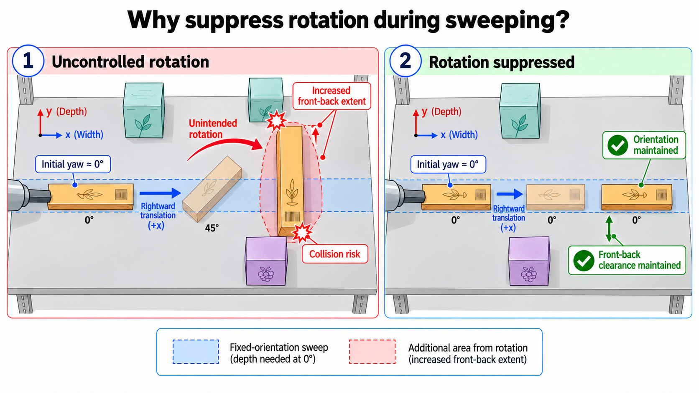
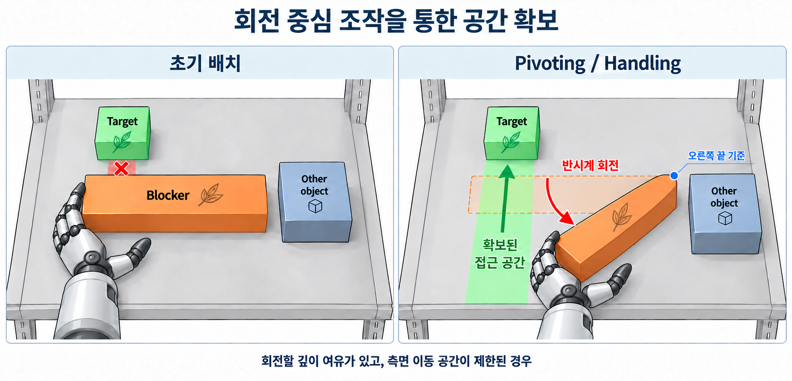

## 초안

현재 연구는 **선반 탐색을 위한 전체 시스템에서, 초기 Pose와 접촉 감각을 이용해 단일 물체를 이동·회전시키는 두 가지 RL Skill을 개발하는 것**으로 정리할 수 있습니다. 다양한 시작 상태에서 실행할 수 있어야 하지만, 장거리 접근과 정책 중단 이후의 처리는 해당 Skill의 주된 담당 범위에서 제외합니다.

**1. 전체 프로젝트 개요**

궁극적인 목표는 편의점이나 물류 창고의 선반 환경에서 **주변 물체를 조작하여 가려진 영역을 드러내고, 사용자가 지정한 목표 물체를 찾는 것**입니다.

상위 판단기는 장면을 관측하고, 목표 물체를 찾기 위해 필요한 조작 대상과 Skill을 선택합니다. 선택한 Skill을 호출하여 물체를 조작하고, 새롭게 확보된 시야를 바탕으로 탐색을 반복합니다. VLM 기반 판단과 MCP 형태의 Skill 호출은 이를 구현하기 위한 시스템 구성으로 고려합니다.

사용자가 지정하는 것은 찾을 물체이며, 개별 조작 대상이나 행동 순서는 상위 판단기가 결정합니다.

| 구성 요소 | 역할 | 현재 졸업연구에서의 위치 |
| --- | --- | --- |
| 상위 판단기 | 조작 대상·Skill·행동 목표 결정, 실행 중단 판단 | 전체 시스템의 배경 |
| 접근 정책 | 조작 대상 근처까지 로봇 이동 | 별도 정책의 담당 |
| Sweep Skill | 대상 물체를 지정한 방향과 거리만큼 이동 | 직접적인 연구 대상 |
| Handling Skill | 대상 물체의 Yaw 방향 변경 | 직접적인 연구 대상 |
| 실행 관리 계층 | Skill 실행·종료 및 이후 호출 관리 | 두 Skill이 연동될 외부 구조 |

실험 플랫폼은 이동 가능한 Base, UR5e, Inspire Robot Hand, 손목 6축 F/T 센서, 손가락별 Force 센서, 손가락·지문부·손바닥 등에 배치된 17개 촉각 센서로 구성합니다. 일정과 구현 여건에 따라 Base를 고정한 상태로 실험할 수 있습니다.

**2. 두 Skill의 공통 Task Definition**

두 Skill은 **대상 물체의 초기 Pose와 과업 목표를 받아, 다양한 EEF 시작 상태에서 접촉을 형성하고 원하는 조작을 수행하는 행동 정책**입니다.

“다양한 시작 상태”는 로봇이 물리적으로 취할 수 있는 모든 상태를 의미하지 않습니다. 선반 탐색 과정에서 실제로 나타날 법한 상태를 의미하며, 대략적으로 Base와 Base에서 먼 선반 끝 사이의 작업 영역을 상정합니다. 구체적인 위치·자세 범위와 초기 상태 분포는 추후 정의합니다.

접근은 별도 정책이 주로 담당합니다. 다만 접근 정책이 접촉 직전까지 완전히 수행된다는 보장은 없으므로, **접촉 전 상태에서 실행되어 남은 접근과 접촉 형성을 수행할 수 있는 능력**이 필요합니다. 따라서 시작 조건을 특정 접촉 자세나 고정된 준비 자세로 한정하지 않습니다.

| 항목 | 공통 정의 |
| --- | --- |
| 대상 물체 정보 | 초기 Pose 제공 |
| 형상·크기 정보 | 현 단계에서는 입력으로 제공하지 않음. 추후 확장 가능성만 유지 |
| 시작 상태 | 선반 탐색 과정에서 발생할 법한 다양한 EEF 위치·자세 |
| 접근 범위 | 주된 접근은 별도 정책이 담당하되, 불완전한 접근 이후의 잔여 접근은 수행 가능해야 함 |
| 접촉 관측 | 손목 F/T, 손가락 Force, 촉각 센서 정보 |
| 로봇 관측 | 관절 상태 등 고유감각 정보 |
| 초기 환경 | 단일 조작 대상 물체 |
| 외부 중단 | 실행 프로세스 종료에 가까운 외부 강제 종료 |
| 향후 확장 | 다중 물체 및 Multi-Contact 상황 |

형상·크기를 **관측 입력으로 제공하지 않는 것**과 학습·평가에 포함할 **물체 종류의 범위를 제한하는 것**은 별도로 정해야 합니다. 현재 설명만으로 임의 형상의 모든 물체에 대응한다고 가정하지 않습니다.

**3. Sweep Skill**

Sweep은 **초기 Pose가 주어진 단일 물체를 지정한 방향과 거리만큼 밀어 이동시키는 정책**입니다. 조작 중 대상 물체의 현재 Pose는 관측할 수 없으며, 접촉 감각과 로봇 상태를 통해 조작을 이어갑니다.

| 항목 | 정의 |
| --- | --- |
| 목적 | 물체의 병진 이동을 통해 가려진 영역이나 여유 공간 확보 |
| 과업 입력 | 대상 물체의 초기 Pose, 목표 이동 방향, 목표 이동 거리 |
| 시작 조건 | 탐색 과정에서 나타날 법한 다양한 EEF 상태. 접촉 이전 상태도 포함 |
| 수행 범위 | 필요한 잔여 접근, 접촉 형성, 밀기 |
| 실행 중 관측 | 고유감각, F/T, 손가락 Force, 촉각 정보 |
| 관측 제한 | 대상 물체의 현재 Pose를 직접 제공하지 않음 |
| 정상 성공 | 물체가 지정한 방향으로 목표 이동 거리를 허용 오차 내에서 달성 |
| 외부 중단 | 목표 거리 달성 여부와 무관하게 외부에서 실행 종료 가능 |

목표 거리는 **물체의 변위**를 의미합니다. EEF 이동량은 물체 이동량과 같다고 가정하지 않습니다.

이 Skill은 외부 판단에 따라 목표 거리까지 수행되지 않을 수 있습니다. 예를 들어 A를 오른쪽으로 미는 도중 충분한 공간이 확보되면 실행을 종료하고, 이후 B를 왼쪽으로 미는 Skill을 호출할 수 있습니다.

여기서 두 요구사항을 구분합니다.

- **외부 중단 가능성:** 실행 도중 정책의 구동을 종료할 수 있어야 합니다.
- **다양한 시작 상태에 대한 대응:** 이후 호출되는 Skill은 앞선 조작으로 달라진 EEF 상태에서도 시작할 수 있어야 합니다.

중단 신호에 대한 반응, 후퇴 동작, 다음 정책으로의 전환을 RL 정책이 학습해야 한다는 요구는 두지 않습니다. 프로세스 종료 후 로봇의 명령 유지·정지 처리는 실행 계층에서 별도로 정의할 사항입니다.

**4. Handling Skill**

Handling은 **단일 물체의 끝부분이나 가장자리에 손가락 접촉을 형성하고, 힘을 가하여 물체의 Yaw 방향을 바꾸는 정책**입니다. 회전 과정에서 약간의 병진 이동은 허용하며, 들어 올리거나 기울이는 동작은 현재 과업에 포함하지 않습니다.

| 항목 | 정의 |
| --- | --- |
| 목적 | 물체 방향을 바꾸어 가려진 영역이나 여유 공간 확보 |
| 과업 입력 | 대상 물체의 초기 Pose, 목표 Yaw 변화량 또는 목표 Yaw |
| 시작 조건 | 탐색 과정에서 나타날 법한 다양한 EEF 상태. 접촉 이전 상태도 포함 |
| 수행 범위 | 필요한 잔여 접근, 끝부분·가장자리 접촉 형성, 회전 유도 |
| 주된 물체 운동 | 선반 지지면 위에서의 Yaw 회전 |
| 허용되는 부수 운동 | 약간의 병진 이동 |
| 정상 성공 | 허용되는 병진 이동 범위 안에서 목표 Yaw 달성 |
| 외부 중단 | Sweep과 마찬가지로 외부 실행 종료 가능 |

목표 Yaw를 상대 회전량으로 줄지 절대 자세로 줄지, “약간의 병진 이동”을 어느 정도까지 허용할지는 추후 구체화합니다.

관측 조건은 다음 두 안을 유지합니다.

| 관측안 | 정의 |
| --- | --- |
| 1안: 초기 관측 + 접촉 감각 | 초기 Pose만 제공하고, 실행 중에는 고유감각과 F/T·Force·촉각 정보 사용 |
| 2안: 불안정한 Vision 관측 포함 | 실행 중 노이즈가 있는 물체 추적 정보를 포함하는 구성까지 고려 |

2안에서 Vision을 접촉 감각과 결합할지 등 세부 관측 구성은 아직 확정하지 않습니다.

**5. 현재 단계의 Assumption과 범위**

| 구분 | 현재 정리 |
| --- | --- |
| 환경 | 선반 지지면 위의 단일 물체 조작으로 시작 |
| 주변 물체 | 초기 Task에는 포함하지 않음 |
| Multi-Contact | 주변 물체까지 포함하는 다중 접촉은 후속 확장으로 설정 |
| EEF 초기 상태 | 선반 탐색 중 나타날 법한 상태로 제한하되, 구체적인 범위는 추후 정의 |
| 물체 초기 정보 | Pose만 제공. 초기 Pose의 오차 수준은 추후 정의 |
| 물체 형상·크기 | 명시적인 입력으로 제공하지 않음 |
| 접근 | 별도 정책이 주로 수행하지만, 완전한 접근 완료나 초기 접촉을 전제하지 않음 |
| Sweep의 시각 관측 | 실행 중 물체의 현재 Pose는 제공하지 않음 |
| Handling의 시각 관측 | 시각 추적 없는 조건과 불안정한 시각 추적을 포함하는 조건 모두 고려 |
| 중단 | 외부 실행 종료이며, 정책 내부의 전환 행동으로 정의하지 않음 |
| Base 운용 | 고정 실험 가능. 이동 기능을 연구의 필수 조건으로 두지 않음 |

단일 물체 조건에서도 손가락 여러 개나 손바닥이 동일 물체에 동시에 접촉할 수 있습니다. 따라서 초기 단계에서 제외하는 Multi-Contact는 우선 **주변의 여러 물체가 조작에 함께 관여하는 상황**으로 이해합니다.

현재 가장 중요한 미정 사항은 **잔여 접근의 허용 범위**입니다. “접근은 별도 정책이 담당한다”와 “다양한 위치에서 시작할 수 있어야 한다”를 함께 만족시키려면, 이후 실험 설계에서 두 정책의 담당 범위를 정해야 합니다. 다만 지금은 이를 수치로 고정하지 않고, **고정된 준비 자세나 사전 접촉을 요구하지 않는 Skill**이라는 요구사항으로 남겨두면 됩니다.

---

## Method간 우월성 및 연구 의의에 대한 의문

|  | Sweeping | Handling |
| --- | --- | --- |
| Vision O | 가장 쉬우나, 문제는 정책의 판단 주기가 Vision의 Perception 속도에 Dependent 하다는 점이다. 
그래서, 넘어질 것 같을 때 힘을 줄이고 하는 등의 능동적 제어보다, 가장 안전하게 천천히 미는 보수적인 정책 학습이 이루어진다. 
또한, Occlusion의 이슈가 존재한다. 미는 과정에서 로봇 팔이나 핸드가 물체를 가려, 관측이 끊기는 상황이 발생할 수 있다. | Sweeping이 아닌 방식으로 Global Goal(궁극적 타켓 물체 탐색)을 수행할 수 있으나,  Vision-Free Sweeping Policy의 의의를 부정한다.  |
| Vision X | Vision이 존재할 때, 발생하는 문제를 관측 주기가 빠른 힘/접촉 센서로 대체함으로 인하여 빠르고 적응 가능한 정책을 학습할 수 있다는 장점을 가진다.
하지만, 물체 Pose를 직접 관측하는 것이 아닌, 힘/접촉 기반으로 간접 추정하는 것 자체가 난해하다. | Sweeping 정책의 상위 호환으로 기능할 우려가 있다. Translation을 강제적으로 억제하는 것이 아니기 때문에, Sweeping 정책을 일부 내포할 가능성이 있어, Vision-Free Sweeping Policy의 Contribution을 침해할 수 있다. |

Track A는 단일 물체를 대상으로 하는 vision-free lateral sweeping task이다. 로봇은 manipulation 이전에 vision으로 획득한 noisy object pose estimate와 lateral target position을 입력받으며, object 근처의 non-contact EEF pose에서 시작한다. Initial EEF pose와 anthropomorphic hand configuration은 feasible pre-manipulation range 내에서 randomized된다. Manipulation이 시작된 이후에는 object pose를 vision으로 갱신하지 않고 wrist F/T, hand tactile sensing 및 robot proprioception에 의존하여 contact를 형성하고 유지·조절하며 물체를 지정된 lateral target position까지 이동시킨다. Object ground-truth state는 training reward와 evaluation에만 사용한다. Object geometry에 따라 translational accuracy뿐 아니라 undesired rotation 및 instability를 제한하는 것을 고려한다.

- 이에 대한 GPT 의견
    
    **우려는 타당합니다. 다만 가장 큰 위험은 Handling이 Sweep을 포함한다는 것 자체보다, 두 정책에서 각각 무엇을 연구 기여로 주장할지가 아직 분리되지 않았다는 점입니다.** 그리고 “Vision을 쓰면 보수적인 정책이 되고, 쓰지 않으면 빠르고 적응적인 정책이 된다”는 논리는 수정해야 합니다.
    
    **1. Vision의 유무와 반응 속도를 직접 연결하면 방어하기 어렵습니다.**
    
    현재 표에는 다음 인과관계가 들어 있습니다.
    
    > Vision이 느리다 → 정책 판단도 느리다 → 위험에 즉각 대응하기 어렵다 → 천천히 움직이는 정책을 학습한다.
    > 
    
    이것은 **가능한 현상이지 필연적인 결과는 아닙니다.**
    
    | 현재 주장 | 검토 |
    | --- | --- |
    | 정책의 판단 주기는 Vision 처리 속도에 종속된다 | 매 판단마다 새로운 영상 처리를 기다리는 동기식 구조라면 맞음. 필수적인 구조는 아님 |
    | Vision을 사용하면 빠른 접촉 대응이 어렵다 | 저주기 Vision과 고주기 촉각 제어를 결합할 수 있음 |
    | 반응이 느리면 보수적인 정책이 학습된다 | 보상·지연·물체 특성 등에 따라 달라짐. 느려질 수도 있지만, 충돌하거나 실패할 수도 있음 |
    | Vision을 제거하면 빠르고 적응적으로 움직인다 | 촉각 정보와 제어 구조가 이를 가능하게 할 수 있지만, 정보 부족 때문에 오히려 보수적으로 움직일 수도 있음 |
    
    실제로 *Reactive Diffusion Policy*는 저주기 상위 정책과 고주기 촉각 피드백을 결합합니다. 따라서 **“Vision을 사용한다는 사실이 고주기 반응을 막는다”는 주장은 선행연구로 반박될 수 있습니다.** 해당 연구는 모방학습 기반이지만, 이 구조적 반례에는 유효합니다. 논문
    
    Sweep의 문제 설정은 다음처럼 잡는 편이 강합니다.
    
    > **손과 로봇에 의한 가림으로 조작 중 물체 Pose의 지속적인 관측을 보장할 수 없다. 따라서 초기 Pose와 접촉 이력만으로 목표 이동을 수행할 수 있는지를 연구한다.**
    > 
    
    그 위에 **“접촉 피드백을 통해 속도와 안정성의 균형을 개선하는가?”**를 검증 항목으로 올리는 것입니다. 빠른 실행은 전제가 아니라 입증할 결과입니다.
    
    또한 현재 구상은 초기 Pose를 사용하므로, 표현도 **“조작 중 시각 추적에 의존하지 않는 Sweep”**이 가장 정확합니다.
    
    **2. Handling이 Global Goal을 달성한다고 Sweep의 의의가 사라지지는 않습니다.**
    
    상위 목표가 숨겨진 물체 탐색이라면, 밀기·회전·집어 옮기기 등 여러 행동으로 같은 목표를 달성할 수 있습니다. 그중 다른 행동이 가능하다는 사실은 특정 Skill을 무효화하지 않습니다.
    
    다만 다음 두 주장은 구분해야 합니다.
    
    - **방어 가능한 주장:** 가림이 발생하는 조건에서 목표 변위를 수행하는 접촉 기반 Sweep Skill을 제공한다.
    - **검증이 필요한 주장:** 숨겨진 물체 탐색에 Sweep이 반드시 필요하거나, Handling보다 유리하다.
    
    두 번째 주장을 하려면 **실제로 Sweep이 유리한 조건이 있어야 합니다.** 예를 들어 회전보다 병진 이동이 필요한 배치에서 수행 시간이나 공간 확보 효과를 비교할 수 있습니다. 현재 단일 물체 실험만으로 전체 탐색 시스템에서의 필수성까지 주장할 필요는 없습니다.
    
    **우려는 타당합니다. 다만 가장 큰 위험은 Handling이 Sweep을 포함한다는 것 자체보다, 두 정책에서 각각 무엇을 연구 기여로 주장할지가 아직 분리되지 않았다는 점입니다.** 그리고 “Vision을 쓰면 보수적인 정책이 되고, 쓰지 않으면 빠르고 적응적인 정책이 된다”는 논리는 수정해야 합니다.
    
    **1. Vision의 유무와 반응 속도를 직접 연결하면 방어하기 어렵습니다.**
    
    현재 표에는 다음 인과관계가 들어 있습니다.
    
    > Vision이 느리다 → 정책 판단도 느리다 → 위험에 즉각 대응하기 어렵다 → 천천히 움직이는 정책을 학습한다.
    > 
    
    이것은 **가능한 현상이지 필연적인 결과는 아닙니다.**
    
    | 현재 주장 | 검토 |
    | --- | --- |
    | 정책의 판단 주기는 Vision 처리 속도에 종속된다 | 매 판단마다 새로운 영상 처리를 기다리는 동기식 구조라면 맞음. 필수적인 구조는 아님 |
    | Vision을 사용하면 빠른 접촉 대응이 어렵다 | 저주기 Vision과 고주기 촉각 제어를 결합할 수 있음 |
    | 반응이 느리면 보수적인 정책이 학습된다 | 보상·지연·물체 특성 등에 따라 달라짐. 느려질 수도 있지만, 충돌하거나 실패할 수도 있음 |
    | Vision을 제거하면 빠르고 적응적으로 움직인다 | 촉각 정보와 제어 구조가 이를 가능하게 할 수 있지만, 정보 부족 때문에 오히려 보수적으로 움직일 수도 있음 |
    
    실제로 *Reactive Diffusion Policy*는 저주기 상위 정책과 고주기 촉각 피드백을 결합합니다. 따라서 **“Vision을 사용한다는 사실이 고주기 반응을 막는다”는 주장은 선행연구로 반박될 수 있습니다.** 해당 연구는 모방학습 기반이지만, 이 구조적 반례에는 유효합니다. 논문
    
    Sweep의 문제 설정은 다음처럼 잡는 편이 강합니다.
    
    > **손과 로봇에 의한 가림으로 조작 중 물체 Pose의 지속적인 관측을 보장할 수 없다. 따라서 초기 Pose와 접촉 이력만으로 목표 이동을 수행할 수 있는지를 연구한다.**
    > 
    
    그 위에 **“접촉 피드백을 통해 속도와 안정성의 균형을 개선하는가?”**를 검증 항목으로 올리는 것입니다. 빠른 실행은 전제가 아니라 입증할 결과입니다.
    
    또한 현재 구상은 초기 Pose를 사용하므로, 표현도 **“조작 중 시각 추적에 의존하지 않는 Sweep”**이 가장 정확합니다.
    
    **2. Handling이 Global Goal을 달성한다고 Sweep의 의의가 사라지지는 않습니다.**
    
    상위 목표가 숨겨진 물체 탐색이라면, 밀기·회전·집어 옮기기 등 여러 행동으로 같은 목표를 달성할 수 있습니다. 그중 다른 행동이 가능하다는 사실은 특정 Skill을 무효화하지 않습니다.
    
    다만 다음 두 주장은 구분해야 합니다.
    
    - **방어 가능한 주장:** 가림이 발생하는 조건에서 목표 변위를 수행하는 접촉 기반 Sweep Skill을 제공한다.
    - **검증이 필요한 주장:** 숨겨진 물체 탐색에 Sweep이 반드시 필요하거나, Handling보다 유리하다.
    
    두 번째 주장을 하려면 실제로 Sweep이 유리한 조건이 있어야 합니다. 예를 들어 회전보다 병진 이동이 필요한 배치에서 수행 시간이나 공간 확보 효과를 비교할 수 있습니다. 현재 단일 물체 실험만으로 전체 탐색 시스템에서의 필수성까지 주장할 필요는 없습니다.
    
    **3. Translation을 허용하는 Handling이 곧 Sweep의 상위 호환은 아닙니다.**
    
    여기서는 **물체가 병진 이동할 수 있다는 것**과 **지정한 병진 목표를 달성할 수 있다는 것**이 다릅니다.
    
    현재 정의를 따르면 다음과 같습니다.
    
    | 구분 | Sweep | Handling |
    | --- | --- | --- |
    | 명령 | 이동 방향과 거리 | 회전 방향과 각도 |
    | 성공에 필요한 결과 | 지정한 물체 변위 달성 | 지정한 Yaw 변화 달성 |
    | 다른 운동 | 회전은 부수적으로 발생 가능 | 병진은 부수적으로 발생 가능 |
    | 보장하지 않는 것 | 원하는 Yaw 달성 | 원하는 방향·거리의 병진 이동 |
    
    Handling이 회전 과정에서 물체를 5 cm 옮겼다고 해서, “왼쪽으로 5 cm 이동”이라는 명령을 수행할 수 있는 것은 아닙니다.
    
    **상위 호환 우려가 실제로 커지는 것은 Handling을 다음처럼 확장할 때입니다.**
    
    > 원하는 (Δx,Δy,Δψ)(\Delta x,\Delta y,\Delta\psi)를 입력받아 물체의 평면 Pose를 조작한다.
    > 
    
    이 경우 Δψ=0\Delta\psi=0인 목표는 Sweep과 상당히 겹칩니다. 그러면 “왜 하나의 목표 조건부 정책으로 학습하지 않고 두 개로 나누는가?”라는 질문이 타당해집니다.
    
    따라서 **현재 Handling을 회전 목표 Skill로 유지한다면, 병진 이동을 허용한다는 이유만으로 Sweep을 포함한다고 볼 수는 없습니다.**
    
    **4. 그래도 ‘두 개의 별도 연구 기여’로 만들 때는 중복 위험이 큽니다.**
    
    이 부분은 사용자의 우려에 동의합니다.
    
    두 정책이 모두 다음 구성을 공유한다고 가정하겠습니다.
    
    - 초기 물체 Pose만 제공
    - F/T·촉각 이력 사용
    - 동일한 정책 구조와 학습 방식 사용
    - 다양한 EEF 상태에서 시작
    - Sweep은 위치 목표, Handling은 회전 목표
    
    이때 **Task 두 개는 성립하지만, 독립적인 방법론 기여 두 개가 자동으로 생기지는 않습니다.** 목표와 보상만 바꾼 것이라면 하나의 방법을 두 Task에 적용한 것으로 평가될 가능성이 있습니다.
    
    | 연구 구성 | 판단 |
    | --- | --- |
    | 하나의 졸업연구에서 공통 방법을 Sweep·Handling으로 검증 | 자연스러운 구성 |
    | Sweep과 Handling을 각각 독립적인 핵심 기여로 주장 | 각각의 기술적 문제와 해결책을 추가로 구분해야 함 |
    | 중복을 피하려고 Handling에만 Vision을 넣음 | 센서 조건만 달라지고 연구 기여는 여전히 불명확할 수 있음 |
    | 일반적인 평면 Pose 조작 정책으로 통합 | 가능한 방향이지만, 현재보다 문제 범위가 넓어짐 |
    
    **논문 기여를 분리하기 위해 Handling의 병진 운동을 인위적으로 금지하는 것은 권하지 않습니다.** 병진 제한은 좁은 공간에서 물체가 과도하게 이동하면 안 된다는 실제 과업 요구가 있을 때 정당합니다.
    
    **5. 현재 구상에서 더 근본적인 어려움은 ‘접촉 감각으로 무엇을 알 수 있는가’입니다.**
    
    “Pose 간접 추정이 난해하다”는 지적은 중요합니다. 다만 **물체의 전체 Pose를 정확하게 복원해야만 제어할 수 있는 것은 아닙니다.**
    
    접촉 이력으로 접촉 유지 여부, 미끄러짐 징후, 회전 진행에 관한 단서를 얻어 행동할 수는 있습니다. 문제는 그 정보만으로 **목표 이동량이나 회전량의 달성을 충분히 구별할 수 있는가**입니다.
    
    - Sweep: 손이 이동했지만 물체가 덜 이동한 경우를 구별할 수 있는가?
    - Handling: 손가락이 움직였을 때 물체 회전과 접촉점 미끄러짐을 구별할 수 있는가?
    - 공통: 접촉이 끊긴 후 물체 상태에 대한 불확실성을 어떻게 다룰 것인가?
    
    특히 형상·크기를 제공하지 않는 Handling에서는, 같은 손가락 이동이 서로 다른 물체 회전으로 이어질 수 있습니다. **빠른 센서가 있다고 부족한 상태 정보까지 해결되는 것은 아닙니다.** 이 부분은 실제로 실험하여 성립 범위를 확인해야 합니다.
    
    **제 판단으로는, 현재는 두 Skill을 유지하되 연구 기여는 공통 축으로 묶는 구성이 가장 설득력 있습니다.**
    
    > **조작 중 신뢰할 수 있는 물체 시각 추적 없이, 초기 Pose와 접촉 이력을 이용해 목표 지향적인 물체 조작을 수행한다. 이를 병진 중심의 Sweep과 회전 중심의 Handling에서 검증한다.**
    > 
    
    이 구성에서는 Handling이 잘된다고 Sweep의 기여가 침해되지 않습니다. 공통 접근이 서로 다른 조작에도 적용된다는 근거가 됩니다. 반대로 **각 Skill을 별도 논문 수준의 독립 기여로 만들려는 목적이라면**, Vision 유무보다 각각 해결하는 기술적 난제를 먼저 분리해야 합니다.
    
    **3. Translation을 허용하는 Handling이 곧 Sweep의 상위 호환은 아닙니다.**
    
    여기서는 **물체가 병진 이동할 수 있다는 것**과 **지정한 병진 목표를 달성할 수 있다는 것**이 다릅니다.
    
    현재 정의를 따르면 다음과 같습니다.
    
    | 구분 | Sweep | Handling |
    | --- | --- | --- |
    | 명령 | 이동 방향과 거리 | 회전 방향과 각도 |
    | 성공에 필요한 결과 | 지정한 물체 변위 달성 | 지정한 Yaw 변화 달성 |
    | 다른 운동 | 회전은 부수적으로 발생 가능 | 병진은 부수적으로 발생 가능 |
    | 보장하지 않는 것 | 원하는 Yaw 달성 | 원하는 방향·거리의 병진 이동 |
    
    Handling이 회전 과정에서 물체를 5 cm 옮겼다고 해서, “왼쪽으로 5 cm 이동”이라는 명령을 수행할 수 있는 것은 아닙니다.
    
    **상위 호환 우려가 실제로 커지는 것은 Handling을 다음처럼 확장할 때입니다.**
    
    > 원하는 (Δx,Δy,Δψ)(\Delta x,\Delta y,\Delta\psi)를 입력받아 물체의 평면 Pose를 조작한다.
    > 
    
    이 경우 Δψ=0\Delta\psi=0인 목표는 Sweep과 상당히 겹칩니다. 그러면 “왜 하나의 목표 조건부 정책으로 학습하지 않고 두 개로 나누는가?”라는 질문이 타당해집니다.
    
    따라서 **현재 Handling을 회전 목표 Skill로 유지한다면, 병진 이동을 허용한다는 이유만으로 Sweep을 포함한다고 볼 수는 없습니다.**
    
    **4. 그래도 ‘두 개의 별도 연구 기여’로 만들 때는 중복 위험이 큽니다.**
    
    이 부분은 사용자의 우려에 동의합니다.
    
    두 정책이 모두 다음 구성을 공유한다고 가정하겠습니다.
    
    - 초기 물체 Pose만 제공
    - F/T·촉각 이력 사용
    - 동일한 정책 구조와 학습 방식 사용
    - 다양한 EEF 상태에서 시작
    - Sweep은 위치 목표, Handling은 회전 목표
    
    이때 **Task 두 개는 성립하지만, 독립적인 방법론 기여 두 개가 자동으로 생기지는 않습니다.** 목표와 보상만 바꾼 것이라면 하나의 방법을 두 Task에 적용한 것으로 평가될 가능성이 있습니다.
    
    | 연구 구성 | 판단 |
    | --- | --- |
    | 하나의 졸업연구에서 공통 방법을 Sweep·Handling으로 검증 | 자연스러운 구성 |
    | Sweep과 Handling을 각각 독립적인 핵심 기여로 주장 | 각각의 기술적 문제와 해결책을 추가로 구분해야 함 |
    | 중복을 피하려고 Handling에만 Vision을 넣음 | 센서 조건만 달라지고 연구 기여는 여전히 불명확할 수 있음 |
    | 일반적인 평면 Pose 조작 정책으로 통합 | 가능한 방향이지만, 현재보다 문제 범위가 넓어짐 |
    
    **논문 기여를 분리하기 위해 Handling의 병진 운동을 인위적으로 금지하는 것은 권하지 않습니다.** 병진 제한은 좁은 공간에서 물체가 과도하게 이동하면 안 된다는 실제 과업 요구가 있을 때 정당합니다.
    
    **5. 현재 구상에서 더 근본적인 어려움은 ‘접촉 감각으로 무엇을 알 수 있는가’입니다.**
    
    “Pose 간접 추정이 난해하다”는 지적은 중요합니다. 다만 **물체의 전체 Pose를 정확하게 복원해야만 제어할 수 있는 것은 아닙니다.**
    
    접촉 이력으로 접촉 유지 여부, 미끄러짐 징후, 회전 진행에 관한 단서를 얻어 행동할 수는 있습니다. 문제는 그 정보만으로 **목표 이동량이나 회전량의 달성을 충분히 구별할 수 있는가**입니다.
    
    - Sweep: 손이 이동했지만 물체가 덜 이동한 경우를 구별할 수 있는가?
    - Handling: 손가락이 움직였을 때 물체 회전과 접촉점 미끄러짐을 구별할 수 있는가?
    - 공통: 접촉이 끊긴 후 물체 상태에 대한 불확실성을 어떻게 다룰 것인가?
    
    특히 형상·크기를 제공하지 않는 Handling에서는, 같은 손가락 이동이 서로 다른 물체 회전으로 이어질 수 있습니다. **빠른 센서가 있다고 부족한 상태 정보까지 해결되는 것은 아닙니다.** 이 부분은 실제로 실험하여 성립 범위를 확인해야 합니다.
    
    **제 판단으로는, 현재는 두 Skill을 유지하되 연구 기여는 공통 축으로 묶는 구성이 가장 설득력 있습니다.**
    
    > **조작 중 신뢰할 수 있는 물체 시각 추적 없이, 초기 Pose와 접촉 이력을 이용해 목표 지향적인 물체 조작을 수행한다. 이를 병진 중심의 Sweep과 회전 중심의 Handling에서 검증한다.**
    > 
    
    이 구성에서는 Handling이 잘된다고 Sweep의 기여가 침해되지 않습니다. 공통 접근이 서로 다른 조작에도 적용된다는 근거가 됩니다. 반대로 **각 Skill을 별도 논문 수준의 독립 기여로 만들려는 목적이라면**, Vision 유무보다 각각 해결하는 기술적 난제를 먼저 분리해야 합니다.
    

---

## 정리된 Task

1. Only Translation, W/O Rotation Sweeping Policy
    - 비대칭형 물체를 밀 때, Rotation을 억제하지 않고 밀면, 다른 물체와 간섭을 일으킬 가능성을 키운다.
2. Little Translation, Rotation Handling Policy
    - Pivoting(용어는 고려 필요)이 유리한 케이스가 있다 → 이거를 잘

---

## 내일 의논할 사항 정리

1. 교수님) F/T-based / Vision-based 였는데 → Vision-Free 2개로 변경된 이유
    - 전체 Global Task Framework에 대하여, 한쪽이 Vision 정보를 사용한다면, 전체 Condition에 위배됨
    - 따라서, 졸업 발표 때, 이 모순점에 대하여 지적이 들어올 가능성이 크다.
2. Handling과 Sweeping으로 나눌 경우, Sweeping을 Pure Translation Action으로 정의한다면(가정, 비대칭 형상), Handling은 Pure Rotation Action으로 정의해야 한다. 하지만, Translation이 무시된 **순수 Rotation**은 별로 가치가 없다.(뒷 공간을 확보하는게 힘들기 때문) 따라서, Pivoting 같이, 확보할 수 있는 공간을 넓히는 방향으로 학습하는 것이 좋지 않을까?
3. Geometry Issue
    - 엄밀한 Pivoting Action을 정의하기 위해서는, 물체의 정확한 Geometry (혹은 근사된 Geometry)를 알고 있어야 정의할 수 있다. 다만, 이럴 경우 Zero-Shot 정책의 학습을 목표하는 경우와 모순이 발생한다.
    - 또한, 현재까지 진행된 모든 논의는, Initial Target Pose 정보는 알고 있다는 조건을 가진다. 하지만, 이는 선행 Task에서 물체의 Pose를 추정할 때, 어느 정도의 Geometry를 필연적으로 획득하거나, 혹은 Pose 추정 시 Geometry를 알고 있다는 말이다. 그렇다면, 이 하위 Task에 Geometry 정보를 넘기는 것이 가능한데, 그러면 Geometry를 모른다는 전제 조건을 깔고 갈 이유가 있는가?

---

## GPT

**선반 탐색을 위한 Vision-Free Sweeping·Handling Skill 연구 개요**

본 연구는 선반 환경에서 가려진 목표 물체를 찾기 위한 두 가지 RL 접촉 조작 Skill을 개발한다. Sweeping은 회전을 억제하면서 물체를 병진 이동시키고, Handling은 회전을 주된 운동으로 사용하면서 소량의 병진 이동을 수반한다. 두 Skill 모두 초기 물체 Pose와 고유감각·힘·촉각 정보를 이용하며, 실행 중 물체의 시각 추적을 사용하지 않는다.

Handling과 Pivoting은 현재 논의에서 같은 동작을 지칭한다. 다만 고정된 회전축이나 접촉점을 유지하는 엄밀한 Pivoting을 요구하지 않으며, 이후에는 Handling으로 통일한다. 핵심은 이러한 회전 중심 조작이 짧은 병진 이동보다 유리한 공간 조건을 구체화하고 검증하는 것이다.

**1. 전체 프로젝트의 목표와 담당 범위**

전체 프로젝트의 목표는 편의점이나 물류 창고의 선반에서 사용자가 지정한 목표 물체를 발견하는 것이다. 상위 판단기는 장면을 관측하여 조작 대상, Skill, 행동 목표를 선택한다. 조작 결과로 새롭게 드러난 영역을 다시 관측하고 탐색을 반복한다. VLM 기반 판단과 MCP 형태의 Skill 호출은 시스템 구현 수단으로 고려한다.

본 졸업연구는 이 중 두 RL Skill의 학습과 검증을 담당한다. 상위 탐색 전략과 주된 접근 동작은 별도 구성 요소가 담당한다. 각 Skill은 접근이 완전히 끝나지 않은 상태에서도 필요한 잔여 접근과 접촉 형성을 수행할 수 있어야 한다.

두 Skill은 탐색의 특정 순서에 고정되지 않는다. 탐색 과정에서 나타날 법한 다양한 EEF 상태에서, 도달 가능성과 접촉 및 작업 여유 공간을 만족하면 호출할 수 있어야 한다. 구체적인 초기 상태 범위는 추후 정의한다.

**2. 첨부 그림을 반영한 문제 설정**

첨부 그림의 초록색 OCC를 가려진 영역으로 해석하면, 두 동작의 공통 목적은 가림 물체 B를 조작하여 그 안의 관심 영역을 관측하거나 접근할 수 있게 만드는 것이다. 그림은 개념도로 사용하며, 표시된 지점의 정확한 의미나 화살표의 실행 주체, 거리·각도·장애물 배치를 확정하는 근거로 사용하지 않는다.

회전을 억제한 병진 이동에서는 물체의 모든 점이 같은 방향으로 같은 거리만큼 이동한다. Handling에서는 회전과 작은 병진이 결합하므로, 물체의 각 부분이 서로 다른 방향과 거리로 이동할 수 있다. 예를 들어 한쪽 끝은 조금만 이동시키면서 다른 쪽 끝은 관심 영역에서 더 크게 비켜나게 하는 조작이 가능할 수 있다.

따라서 Handling의 유용성은 다음 질문으로 검증한다.

“같은 관심 영역을 드러내기 위해, 짧은 병진 이동은 충분한 틈을 만들지 못하거나 주변 공간 제약을 위반하지만, 회전과 작은 병진을 결합한 Handling은 이를 달성할 수 있는가?”

회전이 가려진 전체 면적을 항상 줄인다고 가정하지 않는다. 현재 탐색에 필요한 관심 영역을 노출하거나 그쪽으로의 접근을 가능하게 하는 국소적인 효과가 핵심이다.

**3. 공통 Setup과 Assumption**

| 항목 | 정의 |
| --- | --- |
| 플랫폼 | 이동 가능한 Base + UR5e + Inspire Robot Hand |
| 센서 | 손목 6축 F/T, 손가락별 Force, 손가락·지문부·손바닥 등에 배치된 17개 촉각 센서 |
| Base 운용 | 고정 상태 실험 가능. 초기 고정 운용은 제안 사항 |
| 초기 환경 | 선반 지지면 위의 단일 강체 물체 |
| Target Object | 밀기·회전이 가능한 제한된 물체군에서 시작. 비대칭 또는 길쭉한 형상 등은 평가 후보이며 구체적인 종류·치수는 미정 |
| 초기 정보 | 해당 Skill 호출 시의 물체 초기 Pose 제공 |
| 형상·크기 | 정책 입력에서 제외. 향후 고려 가능성만 유지 |
| Vision-Free | 실행 중 영상·영상 특징·물체 Pose 추적을 두 정책에 제공하지 않음 |
| 외부 Vision | 초기 Pose 획득과 상위 판단기의 관측에는 사용 가능 |
| EEF 초기 상태 | Base와 먼 선반 끝 사이 등 탐색 과정에서 나타날 법한 유효 위치·자세 |
| Initial Joint State | 하나의 고정 벡터 대신 유효 초기 Joint State 집합 사용. 범위·분포·구체 수치는 추후 결정 |
| 초기 속도·Hand 자세 | 아직 미정. 초기에는 정지 상태와 Task별 기본 Hand 자세를 사용하는 방안 고려 |
| 접근 | 주된 접근은 별도 정책 담당. 잔여 접근과 접촉 형성은 해당 Skill에서 수행 가능해야 함 |
| 중단 | 외부에서 정책 실행 프로세스를 종료하는 방식. 중단 트리거에 대한 전환 동작을 학습하지 않음 |
| 평가 정보 | 실제 물체 Pose는 별도 측정 가능하되 정책 입력에서는 제외 |
| 후속 확장 | 주변 물체가 있는 배치 평가, 이후 다중 물체 접촉까지 확장 |

물체의 회전·병진 조건은 물체 운동에 대한 정의이다. 이를 수행하기 위한 Hand나 EEF의 움직임을 같은 형태로 제한하지 않는다. 상위 판단기는 주변 배치에 맞는 명령을 선택하며, 초기 단일 물체 Skill에 일반적인 장애물 회피 능력이 있다고 가정하지 않는다.

**4. Task A — 회전을 억제하는 Sweeping**

초기 Pose가 주어진 단일 물체를 지정한 방향과 거리만큼 이동시키면서 물체의 회전을 억제한다. 비대칭 형상이나 편심 접촉 등으로 발생할 수 있는 회전 때문에 물체의 모서리나 돌출부가 주변 영역을 침범하는 상황을 줄이는 것이 목적이다.

| 항목 | Task Definition |
| --- | --- |
| 입력 | 초기 물체 Pose, 목표 이동 방향, 목표 이동 거리 |
| 주된 운동 | 물체의 병진 이동 |
| 억제할 운동 | 의도하지 않은 물체 회전 및 과도한 횡방향 이탈 |
| 수행 범위 | 필요한 잔여 접근, 접촉 형성, 밀기 |
| 관측 | 초기 Pose + 로봇 고유감각 + 힘·촉각 정보 |
| 성공 기준 | 목표 변위 달성 및 조작 중 회전 억제 |
| 안정 조건 | 전도·낙하·의도하지 않은 들림 방지 |

Only Translation, W/O Rotation은 이상적인 목표로 두며 실제 평가는 허용 오차를 사용한다. 회전은 최종 오차뿐 아니라 실행 중 최대 이탈로 평가하는 것이 적절하다. 도중에 크게 회전했다가 복귀하는 행동은 주변 간섭을 줄이려는 목적에 부합하지 않기 때문이다.

Sweeping이 유리한 대표 조건은 현재 방향으로 이동할 통로는 있지만 회전을 허용할 여유가 작은 배치이다. 예를 들어 길쭉한 물체를 좁은 통로를 따라 이동시키거나, 비대칭 물체의 돌출부가 회전하면 주변 영역을 침범하는 배치가 해당한다.

**5. Task B — 회전 중심의 Handling**

초기 Pose가 주어진 물체의 끝부분 또는 가장자리에 손가락 접촉을 형성하고, 회전을 주된 운동으로 사용하여 물체의 Yaw를 바꾼다. 접촉 과정에서 소량의 병진 이동이 함께 발생할 수 있으며 이를 허용한다. 회전축, 물체 중심 또는 특정 접촉점이 고정되어야 한다는 조건은 두지 않는다.

| 항목 | Task Definition |
| --- | --- |
| 입력 | 초기 물체 Pose, 목표 Yaw 변화량 또는 목표 Yaw |
| 주된 운동 | 물체의 Yaw 회전 |
| 수반 운동 | 소량의 병진 이동 |
| 접촉 방식 | 물체 끝부분·가장자리에 손가락을 접촉시켜 회전 유도 |
| 수행 범위 | 필요한 잔여 접근, 접촉 형성, 회전 중심 조작 |
| 관측 | 초기 Pose + 로봇 고유감각 + 힘·촉각 정보 |
| 성공 기준 | 목표 회전 달성, 병진 이동 규모와 안정성 조건 충족 |
| 제외 운동 | 의도적인 들어 올리기, Roll·Pitch 방향 기울이기, 전도 |

소량의 병진 이동은 물체 크기와 작업 공간을 고려하여 추후 수치화한다. 현재 단계에서는 이전 개요의 고정 중심 부근 회전 또는 엄격한 위치 유지 조건으로 확정하지 않는다. 평가 시에는 일관된 물체 기준점의 최종 변위와 실행 중 최대 이탈을 기록할 수 있으며, Hand 이동량이나 총 조작 시간은 별도로 측정한다.

Handling의 실행 목표는 물체 회전이다. 관심 영역 노출과 접근 공간 확보는 상위 시스템이 이 Skill을 선택하는 목적이며, 현재 정책 입력에 관심 영역 좌표나 장면 형상을 추가한다고 가정하지 않는다.

**6. Handling이 짧은 Translation보다 유리할 수 있는 조건**

| 대표 상황 | 짧은 병진 이동의 한계 | Handling의 기대 효과 | 성립 조건 |
| --- | --- | --- | --- |
| 한쪽 끝의 이동 여유는 작고 다른 쪽 끝이 관심 영역을 가림 | 관심 영역을 충분히 비우도록 전체를 밀면 이동 여유가 작은 끝도 동일하게 움직임 | 이동 여유가 작은 부분은 적게 움직이고 가림에 관여하는 끝은 더 크게 비켜나게 할 수 있음 | 끝부분의 회전 경로와 Hand 접촉 공간 확보 |
| 길쭉하거나 비대칭인 물체의 일부가 관측·접근 방향을 가로막음 | 가능한 짧은 변위 안에서는 해당 부분이 계속 관심 영역과 겹침 | 방향 변화로 해당 부분을 관측·접근 방향 밖으로 이동시킬 수 있음 | 전체 이동 경로가 충돌 없이 실행 가능 |
| 관심 영역 쪽에 쐐기 모양의 작은 틈이 필요 | 병진 이동은 물체 전체에 같은 변위를 요구하므로 다른 영역에서 불필요한 이동이 발생 | 회전과 작은 병진을 결합하여 필요한 쪽에 더 큰 틈 형성 | 넓어지는 틈 반대쪽에서의 간섭을 허용 범위 내로 유지 |

가장 명확한 대표 시나리오는 다음과 같다.

길쭉한 가림 물체 B의 한쪽 끝 근처에는 이동 여유가 작고, 다른 쪽 끝이 관측하려는 영역을 가리고 있다. 짧은 병진 이동으로는 관심 영역이 충분히 드러나지 않는다. 이동량을 늘리면 여유가 작은 쪽이 주변 영역을 침범한다. 반면 Handling으로 물체의 방향을 바꾸면, 한쪽 끝의 이동을 작게 유지하면서 다른 쪽 끝을 비켜나게 하여 관심 영역을 드러낼 수 있다.

이는 고정된 Pivot을 유지하도록 요구하는 시나리오가 아니다. 원하는 공간 변화가 발생하도록 회전과 작은 병진이 함께 이루어지는 결과를 요구한다. 시나리오의 주변 물체는 초기 학습에 강제로 도입하지 않으며, 가상 금지 영역이나 후속 배치 실험으로 효과를 검증한다.

이 조건에서도 Handling이 항상 더 빠르거나 에너지를 적게 쓴다고 가정하지 않는다. 물체 기준점의 작은 병진 이동은 작은 끝부분 이동이나 짧은 EEF 경로와 동의어가 아니다. 공간적 유용성과 실행 비용을 따로 평가한다.

**7. 비교 실험과 별도 Skill의 의의**

두 Skill의 공간적 유용성은 동일한 관심 영역 노출 또는 접근 가능한 틈 확보를 기준으로 비교한다. Sweeping의 목표 변위 성공률과 Handling의 목표 각도 성공률만 직접 비교해서는 이러한 유용성을 입증할 수 없다.

| 평가 질문 | 평가 방법 |
| --- | --- |
| 짧은 병진으로도 충분한가? | 허용되는 병진 방향과 거리에서 관심 영역이 충분히 드러나는지 확인 |
| Handling은 어떤 경우에 성공하는가? | 같은 초기 배치에서 회전과 작은 병진으로 동일한 노출·틈 목표를 달성하는지 확인 |
| 차이가 Task 기하에서 오는가? | 가능한 병진 목표들을 검토하여 임의의 불리한 방향 하나와만 비교하지 않음 |
| 주변 간섭을 줄이는가? | 조작 전 구간에서 물체와 Hand가 차지하는 영역을 평가 |
| 실행 비용은 어떤가? | 물체 변위·회전, Hand 경로, 수행 시간, 접촉력, 전도·충돌을 구분하여 기록 |
| 초기 Skill이 학습 가능한가? | 단일 물체에서 시각 추적 없이 목표 운동과 접촉을 유지하는지 검증 |

짧은 병진의 거리 범위와 Handling의 소량 병진 범위는 사전에 정의한다. 주변 공간 및 허용 접촉력 등 공통 조건도 맞춘다. 실현 가능한 더 좋은 병진 방향이 있다면 비교에 포함한다. 양쪽의 회전각과 이동 거리를 임의로 하나의 비용으로 합쳐 우열을 정하지 않는다.

두 Skill의 기능적 의의는 상위 판단기에 서로 다른 공간 변화 방식을 제공하는 것이다. Sweeping은 방향을 유지한 이동이 유리한 배치에 사용하고, Handling은 물체의 각 부분을 서로 다르게 움직여 국소 영역을 확보하는 편이 유리한 배치에 사용한다. 별도 학습의 성능상 이점은 후속 비교 대상이며, 현재 핵심 주장은 공간 조건에 따른 두 동작의 유용성이다.

**8. 연구 목적문**

본 연구는 선반 환경에서 가려진 목표 물체를 탐색하기 위한 두 가지 Vision-Free 접촉 조작 Skill을 개발한다. Sweeping Skill은 물체의 회전을 억제하면서 지정된 방향과 거리의 병진 이동을 수행하며, Handling Skill은 회전을 주된 운동으로 사용하고 소량의 병진 이동을 수반하여 물체의 방향을 변경한다. 두 Skill은 초기 물체 Pose와 로봇의 고유감각 및 힘·촉각 정보를 이용하여 조작 중 시각 추적 없이 과업을 수행하도록 학습한다. 특히 Handling은 고정된 회전축을 요구하지 않으며, 짧은 병진 이동만으로는 확보하기 어려운 국소적인 관측·접근 공간을 만들 수 있는 조건을 검증한다. 초기에는 단일 물체를 대상으로 기본 조작 성능을 평가하고, 이후 주변 공간 제약이 존재하는 선반 배치에서 각 Skill의 유용성과 상호 보완성을 확인한다.

---

# 정리본

## **Vision 사용 여부와 두 정책의 역할 중복**

### **① 출발점: 기존 Sweeping의 한계**

기존 연구는 **Vision-based Sweeping**입니다. 해당 구성에 대한 문제 인식은 다음과 같습니다.

- **관측·판단 주기의 제약:** **Vision의 Perception 속도에 정책 판단이 종속**되어, 접촉 변화에 즉각 대응하기 어렵습니다. 이에 따라 위험 징후에 능동적으로 대응하기보다 천천히 미는 보수적인 정책이 학습되는 문제가 있습니다.
- **Occlusion:** 조작 중 로봇 팔이나 Hand가 물체를 가리면 **시각 관측이 끊길 수 있습니다.**

따라서 **Vision-Free & Force-based Sweeping**으로 발전시켜, 빠른 힘·접촉 관측을 바탕으로 조작 중 변화에 대응하는 정책을 학습하고자 합니다. 빠른 실행과 적응성은 이 접근에서 기대하는 효과입니다.

### **② Pivoting을 함께 제시하면서 발생하는 논의점**

| Task | Vision-based | Vision-Free |
| --- | --- | --- |
| **Sweeping** | **기존 김태호 연구.** Vision 처리 속도에 따른 판단 주기 제약과 조작 중 Occlusion이 문제로 제기됨. | 힘·접촉 정보를 이용하여 시각 관측 단절에 대응하고, 빠르고 적응적인 조작을 목표로 함. |
| **Pivoting** | 동일한 선반 조작에서 Vision을 사용하므로, Sweeping의 Vision-Free 필요성을 설명하는 **Occlusion 논리와 정합성 문제가 발생함.** | **대안에서 발생한 우려.** 회전과 병진을 함께 수행하므로 Sweeping 기능까지 일부 포함하여, **두 정책의 역할과 Contribution이 중복될 가능성**이 있음. |

쟁점은 두 단계로 구분됩니다.

- **Pivoting에 Vision을 사용하면:** “동일한 Low-Level 조작 환경에서 왜 Sweeping은 Vision-Free가 필요하고, Pivoting은 Vision에 의존해도 되는가?”라는 질문이 발생합니다.
- **Pivoting도 Vision-Free로 바꾸면:** “병진도 가능한 Pivoting이 있는데, 별도의 Sweeping이 왜 필요한가?”라는 질문이 발생합니다.

### **③ 제안하는 해결 방향: 관측 조건을 통일하고, 필요한 운동 특성을 구분**

두 정책 모두 **Vision-Free**로 설정하고, 다음과 같이 역할을 정의합니다.

| 구분 | Sweeping | Pivoting / Handling |
| --- | --- | --- |
| 정의 | **Rotation을 억제하는 병진 조작** | **회전이 주된 운동이며 소량의 병진을 수반하는 조작** |
| 변경 사항 | 회전 억제를 Task의 명시적인 요구사항으로 추가 | 기존 동작 정의 유지. 고정 회전축은 요구하지 않음 |
| 필요한 상황 | 병진 이동 공간은 있지만, 회전하면 모서리·돌출부가 주변과 간섭하는 배치 | 짧은 병진으로는 필요한 영역을 확보하기 어렵지만, 방향을 바꾸면 국소적인 관측·접근 공간을 확보할 수 있는 배치 |
| 상위 Planner가 선택하는 이유 | **방향을 유지한 이동이 필요함** | **회전을 통한 공간 변화가 필요함** |

!ChatGPT Image 2026년 9월 11일 오후 02_19_28.png

!ChatGPT Image 2026년 9월 11일 오후 02_40_08.png

## **Geometry 정보의 필요성과 부분 관측 환경의 정합성**

핵심 쟁점은 **“방향을 고려한 조작을 위해 어느 정도의 형상 정보가 필요한데, 그 정보를 실제 환경에서 확보할 수 있다고 가정해도 되는가?”**입니다.

### **① 출발점: 두 Skill 모두 물체의 방향과 공간적 크기를 고려해야 함**

- **Rotation-Constrained Sweeping:** 초기 방향을 유지하며 이동해야 하므로, 물체의 방향과 회전 시 점유 공간에 영향을 주는 **형상·크기가 중요**합니다.
- **Pivoting / Handling:** 회전을 유도할 접촉 위치를 정하고, 회전으로 어떤 공간을 확보할지 판단하려면 물체의 방향과 대략적인 **형상·크기가 중요**합니다.

따라서 기존의 **초기 Pose만 제공하는 구성에서, 근사 Geometry도 함께 제공하는 구성으로 확장하는 방안**을 검토했습니다. 다만 Geometry가 반드시 명시적 입력이어야 한다는 것은 아직 검증할 가정입니다.

### **② 검토한 방안: High-Level Planner에서 근사 Geometry 전달**

상위 Planner가 조작 대상의 초기 Pose를 제공할 때, 같은 관측을 바탕으로 대략적인 형상도 추정하여 전달한다는 논리입니다.

$g=[\text{Shape Type},\,d_1,\,d_2,\,d_3]$

| 정보 | 전달 내용 | 목적 |
| --- | --- | --- |
| 초기 Pose | 위치와 방향 | 조작 대상의 배치와 기준 방향 제공 |
| Shape Type | Box, Cylinder, Capsule 등 | 단순화된 형상 종류 제공 |
| 형상 파라미터 3개 | 형상별 치수. 예: Box의 폭·깊이·높이 | 물체의 대략적인 크기와 공간적 범위 제공 |

여기서 목표는 정밀한 Mesh 복원이 아니라, **단순한 기하 형상으로 근사한 정보 제공**입니다. Shape Type은 범주형 값이므로, 위 표현은 논리적으로 네 항목이며 실제 정책 입력 차원은 인코딩 방식에 따라 달라집니다.

### **③ 고려 사항: Geometry 정보의 타당성**

불완전한 Geometry 정보를 획득할 수 있을 때, **“현실의 Geometry 추정 오차에도 강건하게 동작하는 정책을 어떻게 학습할 것인가?”**

| 구분 | 정리 |
| --- | --- |
| 입력 구성 | 초기 Pose와 함께 근사 Geometry인 `[Shape Type, 치수 3개]`를 제공 |
| 학습 계획 | Sim의 Ground Truth 기반 Geometry Observation에 Noise를 부여 |
| 현실의 문제 | Clutter 환경의 Occlusion과 Self-Occlusion으로 **치수 오차, 편향, 형상 오분류 등이 발생할 수 있음** |
| 남은 쟁점 | Ground Truth 주변의 **무작위 Noise가 이러한 현실의 추정 오류를 충분히 재현하는가** |
| 필요한 고민 | **현실적인 Geometry 추정 오류를 학습에 반영하고, 부정확한 Geometry가 주어져도 조작을 수행할 수 있는 정책을 설계하는 방법** |

<aside>
💡

근사 Geometry를 정책 입력으로 활용하되, 실제 clutter 환경에서는 가림으로 인해 추정 오류가 발생한다. Ground Truth에 **무작위 Noise를 추가하는 것만으로 이러한 오류를 충분히 반영할 수 있는지는 불확실**하므로, 현실의 Geometry 추정 오차에 강건한 정책을 학습하기 위한 관측 및 **학습 설계가 필요하다.**

</aside>

### **④ 현재의 논리적 허점**

현재 논의는 다음과 같이 이어집니다.

1. 방향을 유지하거나 변경하는 조작을 위해 근사 Geometry를 입력하려고 합니다.
2. 실제 선반 환경에서는 가림 때문에 필요한 Geometry를 충분히 관측하지 못할 수 있습니다.
3. 이러한 상황에서 Noise가 포함된 근사 Geometry를 제공하는 것 만으로는 정책이 충분히 강건해지지 않을 가능성이 존재하여 검토가 필요합니다.

<aside>
💡

방향을 고려하는 조작을 위해 근사 Geometry 입력을 검토하고 있으나, 실제 부분 관측 환경에서 해당 정보를 어느 수준의 정확도로 확보할 수 있는지 정해지지 않았다. 정책이 요구하는 Geometry의 수준이 실제 관측 가능한 수준을 초과하면, 연구의 관측 전제와 정책 입력 사이에 불일치가 발생한다.  

</aside>

## 1줄 요약

1. **Task 구성:** 두 정책을 Vision-Free 기반의 회전 억제 Sweeping과 회전 중심 Handling으로 구분하고, 각각이 필요한 상황을 제시하는 방향이 적절한가?
2. **Geometry 입력:** 학습용 Noise만으로 실제 Geometry 추정 오류를 충분히 반영하기 어려울 수 있어, 이러한 오류에 강건한 정책 설계를 위한 Reference 탐색과 검토가 필요하다.

## Feasibility (TODO)

1. 시작 위치 랜덤 학습한 정책을 통해, 연속 Sweeping 이 가능한지 체크 (Homing 제외 정책)
2. Initial EEF Pose Randomization → Target 옆에서 타 정책에 의해(VLA 추정) 도달하는 위치의 Elipsoid 생성, 그 안에서 Randomization 하여 재   학습 및 결과 검토